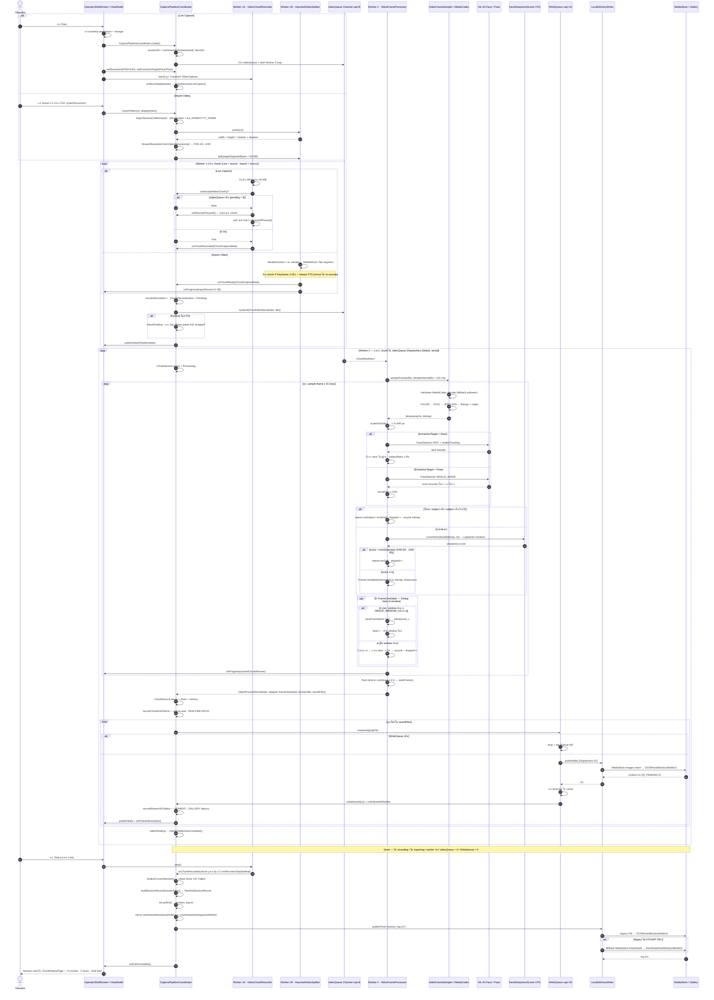

# AutoBots Sequence Flow — Mermaid

> Sequence diagram ของ **AutoBots Sports Camera** ตั้งแต่ Operator กด Start/Import จนภาพ JPEG ขึ้น Gallery และเขียน `session_log.txt`
> อ้างอิงโค้ดจริง: `OperatorViewModel` · `CapturePipelineCoordinator` · `VideoChunkRecorder` · `ImportedVideoSplitter` · `VideoFrameSampler` · `VideoFrameProcessor` · `WriteQueue` · `LocalDeliveryWriter`
>
> ภาพรวมแบบ text/ตาราง อยู่ที่ [PIPELINE_FLOW.md](./PIPELINE_FLOW.md)

---

## 1. Full Pipeline — Live Capture + Import Video

---

## 2. Backpressure — ทำไม Live ถึงหยุดหมุน chunk

> Import ใช้ backpressure ตัวเดียวกัน — `ImportedVideoSplitter.split(canAcceptChunk = ::canAcceptVideoChunk)` ทำให้ไฟล์ยาวแค่ไหนก็ไม่ระเบิด memory

---

## 3. หมายเหตุตัวเลข (source of truth ในโค้ด)

| ค่า | ที่มา | ค่าปัจจุบัน |
|-----|-------|-------------|
| Sample interval | `StreamResolution.FRAME_SAMPLE_INTERVAL_MS` | 120 ms (ทั้ง FHD/UHD) |
| Chunk target | `StreamResolution.chunkTargetBytes` | 50 MB |
| Video queue | `CapturePipelineCoordinator.VIDEO_QUEUE_CAPACITY` | 8 |
| Image queue | `CapturePipelineCoordinator.IMAGE_QUEUE_CAPACITY` | 16 |
| Dedup window | `VideoFrameProcessor.DEDUP_WINDOW_US` | 1,000,000 µs |
| Min sharpness | `MIN_SHARPNESS` / `MIN_SHARPNESS_UHD` | 80.0 / 65.0 |
| Min subject ratio | `MIN_FACE_HEIGHT_RATIO` / `MIN_TORSO_HEIGHT_RATIO` | 5% / 25% |
| Detect width | `ProcessProfile.detectBitmapWidth` | 640 px |
| JPEG quality | sampler 92% (decode) · `saveFrame` 95% (deliverable) | — |

---

## Related

- Pipeline รายละเอียด: [PIPELINE_FLOW.md](./PIPELINE_FLOW.md)
- Operator guide: [OPERATOR_FLOW.md](./OPERATOR_FLOW.md)
- Architecture: [ARCHITECTURE.md](./ARCHITECTURE.md)
- Code layout: [STRUCTURE.md](./STRUCTURE.md)
- Doc index: [DOCS.md](./DOCS.md)
