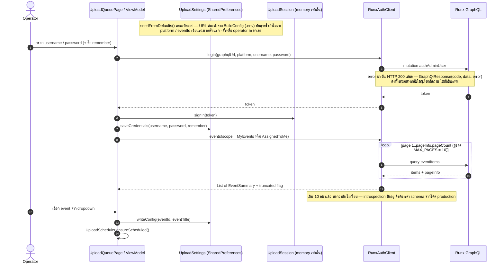
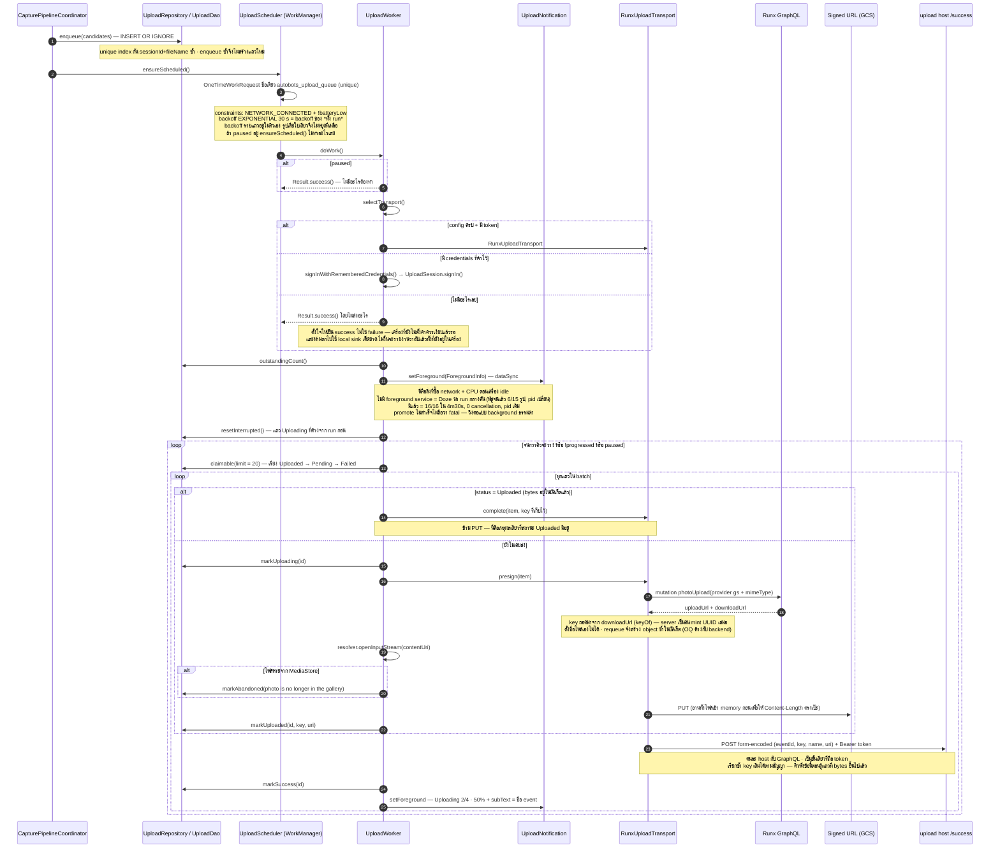
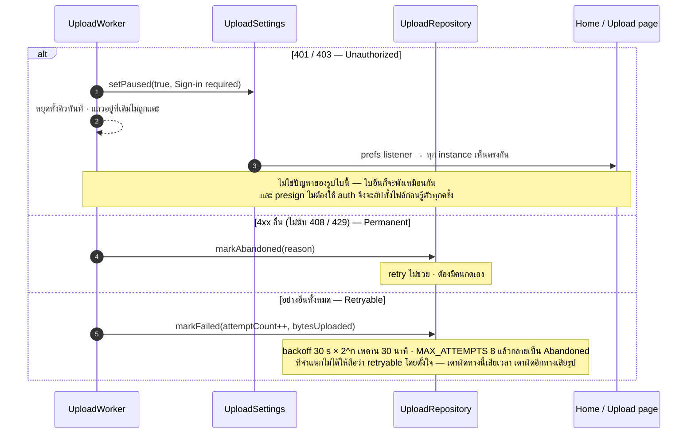
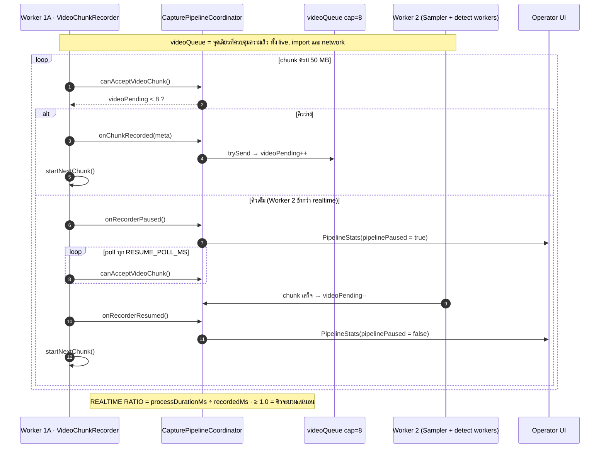
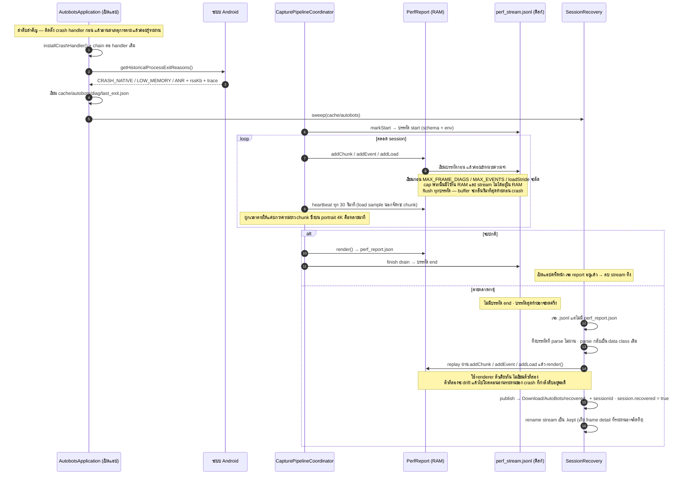

# AutoBots Sequence Flow — Mermaid

> Sequence diagram ของ **AutoBots Sports Camera** ตั้งแต่ Operator กด Start/Import/Network URL จนภาพ JPEG ขึ้น Gallery, เข้าคิวอัปโหลด, ถึงบัคเก็ตปลายทาง และเขียน `session_log.txt` + `perf_report.json`
> อ้างอิงโค้ดจริง **v0.1.5**
> · **ingest/extract:** `OperatorViewModel` · `CapturePipelineCoordinator` · `VideoChunkRecorder` · `ImportedVideoSplitter` · `RemoteVideoFetcher` · `VideoFrameSampler` · `SampledFrame` · `VideoFrameProcessor` · `DetectorSet` · `WriteQueue` · `LocalDeliveryWriter` · `DvfsProbe`
> · **upload:** `UploadRepository` · `UploadDao` · `UploadScheduler` · `UploadWorker` · `UploadSession` · `RunxAuthClient` · `RunxUploadTransport` · `UploadSettings` · `UploadNotification`
>
> ตัวเลข ms/% ของ pipeline มาจาก **TC-16** (network URL · 49m 52s · UHD landscape · NPU · schema 4) และ **TC-18** (browse file · 29m 13s · UHD **portrait**) — ไม่ใช่ค่าประมาณ · ที่มาอยู่ใน [reports/v0.1.5/report.md](../reports/v0.1.5/report.md)
> ตัวเลขชุดเก่าที่ยกมาเทียบมาจาก **TC-12** (`run4mins.mp4` · v0.1.4) ใน [RELEASE_0_1_4.md](./RELEASE_0_1_4.md)
>
> ภาพรวมแบบ text/ตาราง อยู่ที่ [PIPELINE_FLOW.md](./PIPELINE_FLOW.md)

---

## 0. สามทางเข้า หนึ่ง pipeline หนึ่งคิวอัปโหลด

```
Live capture ──record──┐
Browse file  ──remux───┼──▶ videoQueue(8) ──▶ Sampler ──▶ frameQueue(6) ──▶ detect ×2 ──▶ WriteQueue(48)
Network URL  ──range───┘                                                                      │
                                                                                    MediaStore (DCIM)
                                                                                              │
                                                                          upload_items (Room) ──▶ UploadWorker ──▶ Runx
```

ทางเข้าต่างกันแค่ **ใครผลิต chunk** · ตั้งแต่ `videoQueue` เป็นต้นไปเหมือนกันทุกทาง และทุกรูปที่ขึ้น MediaStore สำเร็จจะเข้าคิวอัปโหลดเสมอ (ถ้าคิวไม่ได้ถูก pause)

---

## 1. Full Pipeline — Live Capture · Browse File · Network URL

> **Worker 2 เป็นสองเธรดตั้งแต่ v0.1.4** — Sampler (producer) กับ detect worker (consumer) คั่นด้วย `Channel`
>
> **เฟรมข้ามคิวมาเป็น JPEG ไม่ใช่ bitmap** — producer หยุดที่ `nv21_jpeg` แล้ว worker เป็นคน decode: `inSampleSize` สำหรับ detect และ decode เต็มขนาดเฉพาะเฟรมที่ผ่านด่านขนาด
>
> **v0.1.6 เพิ่มตัวตรวจจับตัวที่สาม และเปลี่ยนวิธีตัดสินใจว่าจะเก็บรูปไหน** — `foot_track_net` (Person) รันบน NPU เดียวกับ face · การจัดอันดับเลิกใช้ sharpness อย่างเดียวมาเป็นคะแนนรวม 5 ด้าน · หน้าต่าง dedup เปลี่ยนจาก "1 วินาทีของนาฬิกา" เป็น "1 วินาทีของคนคนนั้น" ผ่าน `SubjectTracker` · ดู §1 ท้าย loop และ §5.1
>
> **`yuv_nv21` ไม่ใช่คอขวดอีกแล้วตั้งแต่ v0.1.5** — 63.9 → **12.9 ms/เฟรม** (61.7% → 15.9% ของ wall) หลังเปลี่ยนจาก `ByteBuffer.get()` ทีละ byte เป็น bulk row copy พร้อม runtime probe ว่าเครื่องวาง chroma เป็น NV21 หรือ NV12 · ดู §4

```mermaid
sequenceDiagram
    autonumber

    actor Operator
    participant UI as OperatorShellScreen / ViewModel
    participant Coord as CapturePipelineCoordinator
    participant Recorder as Worker 1A · VideoChunkRecorder
    participant Splitter as Worker 1B · ImportedVideoSplitter
    participant Net as RemoteVideoFetcher
    participant VQ as videoQueue Channel cap=8
    participant Sampler as Worker 2P · VideoFrameSampler + MediaCodec
    participant FQ as frameQueue Channel cap=6 — ถือ JPEG
    participant Detect as Worker 2C · detect worker ×2
    participant Det as DetectorSet — face_det_lite / foot_track_net / ML Kit pose
    participant Sharp as FaceSharpnessScorer CPU
    participant Trk as SubjectTracker — ท้าย chunk
    participant Sel as selectKeepers — ท้าย chunk
    participant WQ as WriteQueue cap=48
    participant Writer as LocalDeliveryWriter
    participant Store as MediaStore / Gallery
    participant UQ as upload_items (Room)

    alt Live Capture
        Operator->>UI: Home → Live capture → กด Start
        UI->>UI: ตรวจ camera permission + storage
        UI->>Coord: CapturePipelineCoordinator.create()
        Coord->>Coord: sessionDir = cache/autobots/{sessionId}, facesDir
        Coord->>VQ: เปิด videoQueue + start Worker 2 loop
        UI->>Coord: setResolution(FHD/UHD), setExtractionTarget(Face · Pose · Person — เปิดร่วมกันได้)
        UI->>Recorder: start() ผูก CameraX VideoCapture
        Coord->>Coord: onRecordingStarted() → beginSession(LiveCapture)
        Note over UI: auto-upload switch ล็อกระหว่างอัด — เปลี่ยนกลางคันไม่ได้<br/>KeepScreenOn(active = isCapturing) กันจอดับระหว่างถ่าย
    else Browse Video File
        Operator->>UI: Home → Browse Video → เลือกไฟล์ (OpenDocument)
        UI->>Coord: prepareImport(uri) — probe แล้วหยุดรอที่ Import Preview
        Operator->>UI: เลือก target / backend / ช่วงเวลา แล้วกด Start
        UI->>Coord: importVideo(uri, displayName, trim)
    else Network URL
        Operator->>UI: Home → Network URL → พิมพ์ URL หรือสแกน QR
        UI->>Net: validate() → head() → probe()
        Net-->>UI: content-type · size · fps · resolution
        Note over Net: สตรีมเป็นค่าเริ่มต้น — MediaExtractor ยิง byte-range ตามที่ remux เดินไป<br/>chunk แรกเข้า Worker 2 ได้ตั้งแต่ปลายไฟล์ยังมาไม่ถึง<br/>download() เป็น *fallback* เฉพาะ CDN ที่ปฏิเสธ MediaHTTPConnection (R2 และพวกเดียวกัน)
        UI->>Coord: importVideo(remoteUrl หรือ cache file)
    end

    opt ทั้งสองทางที่เป็น import
        Coord->>Coord: beginSession(VideoImport) · albumFolder = ext_DDMMYYYY_HHMM
        Coord->>Splitter: probe() → width × height × rotation × duration
        Coord->>Coord: StreamResolution.fromVideoDimensions() → FHD หรือ UHD
        Coord->>Splitter: split(targetSegmentBytes = 50 MB)
    end

    loop Worker 1 ผลิต chunk (Live = record · Import/Network = remux)
        alt Live Capture
            Recorder->>Recorder: บันทึก MP4 จนถึง 50 MB
            Recorder->>Coord: canAcceptVideoChunk()?
            alt videoQueue เต็ม (pending = 8)
                Coord-->>Recorder: false
                Recorder->>Coord: onRecorderPaused() — หยุดหมุน chunk
                Recorder->>Recorder: poll จนคิวว่างแล้ว resumeIfPaused()
            else คิวว่าง
                Coord-->>Recorder: true
                Recorder->>Coord: onChunkRecorded(ChunkCaptureMeta)
            end
        else Import / Network
            Splitter->>Splitter: MediaExtractor อ่าน sample → MediaMuxer เขียน segment
            Note over Splitter: ตัด chunk ที่ Keyframe เท่านั้น + rebase PTS (remux ไม่ re-encode)<br/>Network URL: การอ่าน sample คือ HTTP byte-range ไม่ใช่ดิสก์
            Splitter->>Splitter: awaitQueueSpace() — สะสมเวลาเป็น splitBlockedMs
            Splitter->>Coord: onChunkReady(ChunkCaptureMeta) → ประมาณ expectedChunks
            Splitter->>UI: onProgress(importPercent 0–99)
            Note over Splitter,UI: importPercent ไม่ได้ขับ progress bar — มันคำนวณจาก PTS ที่เพิ่ง mux<br/>จึงนิ่งตลอดที่ awaitQueueSpace จอดรอ (95% ของเวลา)<br/>บาร์ใช้ overallProcessingPercent จากฝั่ง extractor แทน
        end

        Coord->>Coord: chunksRecorded++ · ChunkRecord(status = Pending)
        Coord->>VQ: trySend(ChunkWorkItem(index, file))
        alt trySend ไม่สำเร็จ
            Coord->>Coord: videoPending-- และ log Video queue full, dropped
        end
        Coord->>UI: publishStats(PipelineStats)
    end

    loop Worker 2 — แต่ละ chunk ใน videoQueue (chunk ประมวลผลทีละก้อน)
        VQ-->>Sampler: ChunkWorkItem
        Coord->>Coord: ChunkRecord.status = Processing
        Coord->>Detect: launch detect worker ×2 (Dispatchers.Default)
        Coord->>Coord: DvfsProbe.measureNs() ก่อนเริ่ม → chunks[].cpuProbeMs
        Note over Coord: งาน integer ขนาดคงที่ · เทียบข้าม chunk เพื่อดู DVFS drift<br/>🐛 probe ของ chunk 1 โดน JIT ปน ให้ข้ามไปตอนอ่าน<br/>TC-18 เปิดมาที่ cpuMaxFreqKhz 2,016,000 เทียบกับ TC-16 ที่ 2,572,800 — ร้อนค้างจากรอบก่อน
        Coord->>Sampler: sampleFrames(file, 120 ms) [Dispatchers.IO]

        par Producer — เธรด decoder
            loop ทุก sample frame (~8.3 fps ที่ 120 ms)
                Sampler->>Sampler: hardware MediaCodec decode — decode 0.3 ms
                Sampler->>Sampler: YUV420 → NV21 — yuv_nv21 12.9 ms (เคย 63.9)
                Note over Sampler: bulk row copy · pickChromaCopy() probe 64 คู่ทุกเฟรมว่าเครื่องวาง<br/>chroma เป็น NV21 (FromV) หรือ NV12 (FromUSwapped) — ไม่ตรงก็ถอยไป Slow<br/>debug build ตรวจ byte-for-byte กับลูปเดิม 3 เฟรมแรก (verifyFastPath)
                Sampler->>Sampler: NV21 → JPEG 92% — nv21_jpeg 44.2 ms
                Note over Sampler: ตอนนี้เป็นตัวใหญ่ที่สุดฝั่ง producer — platform code ไปต่อยาก
                Sampler->>FQ: send(SampledFrame — JPEG ~2 MB + rotation)
                Note over FQ: เต็ม → decoder รอ · วัดเป็น queue_wait<br/>TC-16 landscape 3.9 ms · TC-18 portrait 32.8 ms = คอขวดย้ายไปฝั่ง consumer
            end
            Sampler->>FQ: close()
        and Consumer — detect worker แต่ละตัว
            loop จนกว่า frameQueue จะปิด
                FQ-->>Detect: receive() — เวลารอวัดเป็น worker_idle (19.2 ms)
                Detect->>Detect: decode(inSampleSize=2) → jpeg_argb_detect 22.7 ms
                Detect->>Detect: downscale → rotate ที่ 640px — scale_for_detect 2.3 ms

                Note over Detect,Det: v0.1.6 — ExtractionTarget เป็น **flag set** ไม่ใช่ enum ของคอมบิเนชัน<br/>เปิดพร้อมกันได้ทั้งสาม และทุกด่านเป็น **AND** · ลำดับคือ face → person → pose<br/>(face ตัดทิ้งเยอะสุดและตัดบน NPU · pose แพงสุดเพราะเป็น ML Kit บน CPU)

                opt usesFace
                    Detect->>Det: face.detect(detectBmp) — LiteRT face_det_lite หรือ ML Kit FAST
                    Det-->>Detect: face bounds + score (null บน ML Kit)
                    Note over Det: enableTracking ถอดออกตั้งแต่ v0.1.4 — เป็นต้นเหตุของ roiInvalid ทั้งหมด<br/>portrait 4K รัน tileCount 3 → detect 13.9 → 43.3 ms/เฟรม (OQ-05)<br/>v0.1.6: กรองด้วย zone **ก่อน** เลือกใหญ่สุด และ score ต้อง ≥ minFaceScore
                    Detect->>Detect: เลือก face ใหญ่สุดในโซน · subjectRatio ≥ 3.0% (UHD) / 3.5% (FHD)
                end

                opt usesPerson
                    Detect->>Det: person.detect(detectBmp) — foot_track_net w8a8 บน QNN HTP
                    Det-->>Detect: person boxes **ของทุกคนในเฟรม**
                    Note over Det: letterbox ทั้งเฟรมลง 640×480 (ไม่ tile แบบ face — คนตัวสูง tile แล้วขาดกลางตัว)<br/>landscape 640×360 → scale 1.0 ไม่ย่อเลย · portrait 640×1137 → 0.42×<br/>อ่านเฉพาะ heatmap คลาส 1 (person) · คลาส 0 (face) กับ landmark 17 จุดยังไม่ได้ถอด
                    alt มี face อยู่แล้ว
                        Detect->>Detect: เอาเฉพาะ person box ที่ **ครอบจุดกึ่งกลางของ face นั้น**
                        Note over Detect: เป็นการ *ยืนยัน* face ไม่ใช่ค้นหารอบสอง<br/>ไม่งั้นคนดูที่ยืนอยู่อีกมุมจะทำให้เฟรมที่ตัวนักวิ่งไม่อยู่ในภาพผ่านด่านได้
                    else ไม่มี face
                        Detect->>Detect: เอา person ใหญ่สุดในโซน · personRatio ≥ 15%
                    end
                    opt เปิดตัวตรวจจับมากกว่าหนึ่งตัว
                        Detect->>Detect: isFullyFramed(personBox) — ห่างขอบ ≥ 2% ทุกด้าน ไม่งั้น rejects.cropped
                        Note over Detect: เหตุผลหลักที่ควรเปิด person คู่กับ face — face นั่งกลางเฟรมสบาย ๆ ได้<br/>ทั้งที่ตัวถูกตัดขาดที่ขอบ มีแต่กล่องลำตัวเท่านั้นที่มองเห็นเรื่องนี้
                    end
                end

                opt usesPose
                    Detect->>Det: pose.detect(detectBmp) — PoseDetector SINGLE_IMAGE
                    Det-->>Detect: torso bounds (ไหล่ + สะโพก)
                    Note over Det: **เห็นได้คนเดียวต่อเฟรม** ตามสเปกของ ML Kit — คืน PoseDetectionResult? ตัวเดียว<br/>จึงใช้ทำ tracking หลายคนไม่ได้ ต่างจาก person
                    Detect->>Detect: torsoRatio ≥ 25%
                end

                Detect->>Trk: recordSighting(ptsUs, ทุกกล่องในโซน, subject)
                Note over Detect,Trk: **บันทึกก่อนด่านตัดสิน** — ถ้าให้ tracker เห็นเฉพาะเฟรมที่ผ่านครบทุกด่าน<br/>คนที่บังเอิญตัวเล็กไป/เบลอไป/ติดขอบ จะหายไปจากสายตา tracker เป็นช่วง ๆ<br/>ช่องว่างพวกนั้นเกิน maxGapUs → คนเดียวแตกเป็น track ละเฟรม<br/>วัดตอนที่ยังผิด: asicsmeta ได้ 139 "คน" ต่อ 32 รูป เกือบทุก track มี frames=1

                alt ไม่พบ subject หรือ subject เล็กเกินไป — TC-16 23%, TC-18 64%
                    Detect->>Detect: rejects.noSubject / tooSmall · skipped++
                    Note over Detect: ไม่เคยแตะ pixel เต็มขนาดเลย — JPEG ถูกทิ้งไปทั้งก้อน
                else ผ่านด่านขนาด — TC-16 17,412/22,643
                    Detect->>Detect: decode(1) ภาพเต็ม 4K — jpeg_argb_full 51.9 ms
                    Detect->>Detect: rotate ภาพเต็ม — TC-16 ไม่เข้าเลย (rotation 0) · TC-18 117 ms × 5,368 ครั้ง
                    Detect->>Detect: mapRect() clamp เข้าขอบภาพ
                    alt ROI < 8 px — วัดไม่ได้
                        Detect->>Detect: rejects.roiInvalid · skipped++
                        Note over Detect: TC-16 และ TC-18 ได้ 0 ทั้งคู่ — ปิดเรื่องนี้ได้แล้ว
                    else ROI ใช้ได้
                        Detect->>Sharp: scoreNormalized(bitmap, roi) — Laplacian variance 1.2 ms
                        Sharp-->>Detect: sharpness score
                        alt score < minSharpness (FHD 80 · UHD 65)
                            Detect->>Detect: rejects.tooSoft · skipped++
                            Note over Detect: TC-16: 5,082 เฟรมจ่ายค่า decode เต็มไปแล้วก่อนถูกตัดที่นี่ ≈ 4.4 นาที (OQ-02)
                        else score ผ่าน
                            Detect->>Detect: FrameQuality.score() — sharpness · size · centre · confidence · framing
                            Note over Detect: ทุกเทอมนอร์มัลไลซ์เป็น 0..1 ก่อนถ่วงน้ำหนัก เพราะหน่วยเทียบกันไม่ได้<br/>Laplacian variance วิ่ง 65–540 ในคลิปเดียว ส่วนที่เหลือเป็นสัดส่วน/ความน่าจะเป็น<br/>confidence หารด้วยเพดานของ detector เอง (face_det_lite แตะได้สูงสุด 0.853)<br/>centre วัดเทียบ **โซนที่ operator วาด** ไม่ใช่กลางเฟรม
                            Detect->>Detect: saveFrame ทันที → {face|pose|person}_c###_{ptsUs}.jpg (JPEG 95%) — save_jpeg 106.0 ms
                            Detect->>Detect: candidates += SavedCandidate(file, sharpness, ptsUs, quality)
                        end
                    end
                end
                Detect->>UI: onProgress(currentChunkPercent)
            end
        end

        Note over Trk,Sel: worker เสร็จไม่เรียงลำดับ — ทั้ง tracking และ dedup จึงทำครั้งเดียวหลังทุกตัว join<br/>**offline คือเคสง่าย**: เห็นทั้ง chunk แล้วค่อยตัดสิน ไม่มี latency budget ให้ป้องกัน
        Trk->>Trk: sort sightings ตาม ptsUs → assign() ทุกเฟรม ทุกกล่อง
        loop ทุกเฟรมที่ sample มา
            Trk->>Trk: pass 1 — IOU เทียบ **กล่องที่ทำนายไว้** (กล่องเดิม + velocity × dt)
            Trk->>Trk: pass 2 — ระยะจุดกึ่งกลาง + ขนาดใกล้เคียง สำหรับที่ pass 1 จับคู่ไม่ได้
            Trk->>Trk: จับคู่ไม่ได้เลย = คนใหม่ · ไม่เจอเกิน 600 ms = ปิด track
        end
        Note over Trk: ทำนายก่อนเทียบเป็นเรื่องจำเป็น ไม่ใช่ของแถม — คนวิ่ง 3 m/s ขยับระหว่างสอง sample (120 ms)<br/>**ไกลกว่าความกว้างตัวเอง** ⇒ IOU ดิบเป็น 0 · ถ้าใช้ IOU เฉย ๆ คนเดียวจะแตกเป็น track ละเฟรม<br/>และความพังแบบนั้น**หน้าตาเหมือนทำงานได้** เพราะทุกเฟรมก็ยังมี id ครบ
        Trk-->>Sel: trackId ของ subject ในแต่ละเฟรม + TrackSummary ทุก track
        Sel->>Sel: จัดกลุ่ม candidates **ตาม trackId** ไม่ใช่ตามนาฬิกา
        loop ทุก track · ทุกหน้าต่าง DEDUP_WINDOW_US (1 s) *ของ track นั้น*
            Sel->>Sel: จัดอันดับตาม quality.total → เก็บ top 3 · ที่เหลือ file.delete() + skipped++
        end
        Note over Sel: เดิมหน้าต่างเป็น "1 วินาทีของนาฬิกา" ซึ่งเท่ากับสมมติว่า 1 วินาที = คนเดียว<br/>สองคนวิ่งมาพร้อมกันจึงแชร์โควตา 3 รูป → เก็บคนใกล้ 3 ใบ อีกคนไม่ได้เลย **โดยตัวนับทุกตัวยังบอกว่าปกติ**<br/>run4mins: 9 จาก 23 chunk มีคนเกินหนึ่ง · c22 แยกได้ 4 คน (track 1, 2, 3, 5)<br/>TC-16: เข้ารหัสไป 12,330 ไฟล์ เก็บจริง 6,578 — ลบทิ้ง 5,752 ไฟล์ที่เขียนลงดิสก์แล้ว ≈ 10 นาที (OQ-01)
        Sel-->>Coord: VideoProcessResult(kept, skipped, framesSampled, durationMs, savedPhotos, **tracks**)
        Coord->>Coord: ChunkRecord.status = Done + metrics
        Coord->>Coord: recordChunkEndToEnd — queue wait · REALTIME RATIO

        loop ทุกไฟล์ใน savedFiles
            Coord->>WQ: enqueue(jpegFile)
            alt WriteQueue เต็ม
                WQ->>WQ: drop + log Queue full
            else
                WQ->>Writer: publish(file) [Dispatchers.IO]
                Writer->>Store: MediaStore.Images insert → DCIM/AutoBots/{subfolder}/
                Store-->>Writer: content Uri (IS_PENDING 0)
                Writer-->>WQ: Uri
                WQ->>Coord: onDelivered(uri) + onDeliveredFile(file)
                Coord->>UQ: enqueueForUpload(uri, file) → INSERT OR IGNORE (status = Pending)
                Note over Coord,UQ: อ่าน size + lastModified ที่นี่ เพราะ WriteQueue ลบ temp file ทันทีหลัง callback คืน<br/>sessionId = albumSubfolder เดียวกับที่รูปเพิ่งถูก publish ลง DCIM<br/>→ แถวในคิวสาวกลับไปหาสิ่งที่ operator มองเห็นได้เสมอ
                Coord->>Coord: UploadScheduler.ensureScheduled(appContext)
                WQ->>WQ: ลบ temp file ใน cache · pending.decrementAndGet()
                Note over WQ: callback ต้องมา *หลัง* ลด pending — ไม่งั้น drain ไม่เกิด (บั๊ก v0.1.3 ข้อ 8)<br/>enqueue นับ pending ก่อน trySend แล้ว rollback เมื่อคิวเต็ม
                Coord->>Coord: recordMomentToGallery — MOMENT→GALLERY latency
                Coord->>UI: publishStats + onPhotoDelivered(uri)
            end
        end

        Coord->>Coord: releaseChunkFile() — ลบ import_###.mp4 / chunk_###.mp4 ทิ้ง
        Note over Coord: cache จึงผูกกับความลึกคิว ไม่ใช่ความยาวคลิป — ≤ 8 chunk ≈ 420 MB<br/>Network URL ที่ตกไปใช้ download() fallback ยังกิน cache เท่าไฟล์ต้นฉบับ · sweepImportCache() เก็บกวาดตอนเปิดแอป
        Coord->>Coord: videoPending-- · maybeNotifyDrainComplete()
    end

    Note over Coord,Store: Drain — ไม่ recording / ไม่ importing / worker ว่าง / videoQueue = 0 / WriteQueue = 0

    Operator->>UI: กด Stop (เฉพาะ Live)
    UI->>Recorder: stop()
    Recorder->>Coord: onChunkRecorded(chunk สุดท้าย) แล้ว onRecorderStopSettled()

    Coord->>Coord: finalizeCurrentSession() → status Done หรือ Failed
    Coord->>Coord: buildSessionRecord(chunkHistory) → PipelineSessionRecord
    Coord->>Coord: toLogText() → session_log.txt · buildPerfReport() → perf_report.json
    Coord->>Coord: writePhotoIndex() → **photos.csv** · writeTrackIndex() → **tracks.csv**
    Note over Coord: photos.csv = 1 แถวต่อรูปที่เก็บ — score, sharpness, คะแนนย่อยทั้ง 5, `track`<br/>tracks.csv = 1 แถวต่อคนที่ผ่านหน้ากล้อง **รวมคนที่ไม่ได้รูปเลย**<br/>photos.csv ตอบไม่ได้ว่า "พลาดใครไปบ้าง" เพราะบันทึกเฉพาะสิ่งที่เก็บได้<br/>`track` คือสะพานเชื่อมสองไฟล์ · ไม่ซ้ำเฉพาะใน chunk เดียวกัน ต้องใช้คู่ chunk+track
    Coord->>Coord: mirror cache/autobots/{sessionId}/ และ cache/autobots/logs/{subfolder}/
    Coord->>Writer: publishText(session_log.txt · perf_report.json · photos.csv · tracks.csv)
    Note over Writer: mimeTypeFor() ต้องรู้จักนามสกุลทุกตัว — MediaStore **เขียนชื่อไฟล์ใหม่ให้ตรง MIME**<br/>ประกาศ .csv เป็น text/plain แล้วจะได้ `photos.csv.txt` (บั๊กจริงที่เจอใน v0.1.6)
    Writer->>Store: legacy File → DCIM/AutoBots/{subfolder}/
    alt legacy ไม่สำเร็จ (API 29+)
        Writer->>Store: fallback MediaStore.Downloads → Download/AutoBots/{subfolder}/
    end
    Store-->>Writer: log Uri
    Coord->>UI: onDrainComplete()
    UI-->>Operator: Session card ใน ChunkHistoryPage — N chunks · X shots · total time
    opt เปิด Person detection
        UI-->>Operator: `~5 people · 3 photographed · 49 others`
        Note over UI: โชว์เฉพาะตอนเปิด person — โหมด face ล้วนก็ track ได้ แต่ track จากกล่องหน้า<br/>ซึ่งหลุดทันทีที่คนก้มหรือหันข้าง ตัวเลขจะน้อยกว่าจริงมาก แต่หน้าตาน่าเชื่อถือเท่ากัน
    end
    Note over UQ: การอัปโหลดเดินต่อของมันเองหลัง drain — ดู §2<br/>artifact ทั้งสองไฟล์ถูกเขียนตอนจบ session เท่านั้น ถ้า crash ระหว่างทางจะไม่มีอะไรเหลือ (NA-05)
```

---

## 2. Upload — จากแถวใน Room ถึงบัคเก็ต

> **token ไม่เคยลงดิสก์** — `UploadSession` ถืออยู่ใน memory ตลอดอายุ process · ปิดแอปแล้วเปิดใหม่ต้อง sign in ใหม่เสมอ (token ฝั่ง backend อายุ 7 วัน แต่เราไม่เก็บ)
> username/password เก็บก็ต่อเมื่อ operator ติ๊ก **remember** และถูกกันออกจาก cloud backup + device transfer (`backup_rules.xml` · `data_extraction_rules.xml`)

### 2.1 Sign in และเลือก event



### 2.2 คิวและ worker



### 2.3 ความล้มเหลวถูกแยกเป็นสามแบบ



---

## 3. Backpressure — ทำไม Live ถึงหยุดหมุน chunk



> Import และ Network ใช้ backpressure ตัวเดียวกัน — `ImportedVideoSplitter.split(canAcceptChunk = ::canAcceptVideoChunk)` ทำให้ไฟล์ยาวแค่ไหนก็ไม่ระเบิด memory และในกรณี Network มันยังกลายเป็น **flow control ของ HTTP** ไปด้วย: splitter หยุดอ่าน = หยุดยิง byte-range
> เวลาที่ splitter จอดรอตรงนี้ถูกแยกออกมาเป็น `splitBlockedMs` ไม่ปนกับความเร็ว remux (`splitActiveMs`)

**ratio ที่วัดได้จริง:**

| Version | Case | `realtimeRatio` |
|---|---|---|
| v0.1.3 | TC-04 · landscape 4K · Worker 2 เธรดเดียว | 2.196 |
| v0.1.4 | TC-12 · landscape 4K · แยก producer/consumer | 1.010 |
| **v0.1.5** | **TC-16 · landscape 4K · 50 นาที · chroma fast path** | **0.615** |
| **v0.1.5** | **TC-18 · portrait 4K · 29 นาที** | **1.046** |

1.046 คือ configuration ที่**แพงที่สุดเท่าที่เคยวัดมา** — detect สามไทล์ + rotate เต็มขนาด + เครื่องร้อนค้างตั้งแต่เฟรมแรก และยังดีกว่าทุกตัวเลข landscape ก่อน v0.1.4

---

## 4. คิวสองชั้นใน Worker 2 และการอ่านว่าฝั่งไหนคือคอขวด

```
videoQueue(8) ──▶ Sampler ──▶ frameQueue(6) ──▶ detect worker ×2 ──▶ selectKeepers ──▶ WriteQueue(48) ──▶ upload_items
   ระดับ chunk        producer       JPEG ~2 MB       consumer          ท้าย chunk         MediaStore        Room
                    หยุดที่ JPEG
```

### stage ทั้งหมดใน schema 4 — ตัวเลขจริงจาก TC-16 (landscape) เทียบ TC-18 (portrait)

| stage | ฝั่ง | TC-16 ms/เฟรม | % wall | TC-18 ms/เฟรม | อ่านว่า |
|--|--|--|--|--|--|
| `decode` | producer | 0.3 | 1.4% | — | dequeue จาก MediaCodec — ไม่เคยเป็นปัญหา |
| `yuv_nv21` | producer | **12.9** | 15.9% | 12.1 | เคย 63.9 ms / 61.7% · bulk row copy แล้ว **ไม่ใช่คอขวดอีกต่อไป** |
| **`nv21_jpeg`** | producer | **44.2** | **54.4%** | 53.7 | **ตัวใหญ่ที่สุดฝั่ง producer ตอนนี้** — platform code ไปต่อยาก |
| `queue_wait` | producer | 3.9 | 4.8% | **32.8** | decoder รอ worker · TC-18 ขึ้น 4.3 → 29.9 ms ระหว่างรัน (+590%) = **คอขวดย้ายไปฝั่ง consumer** |
| `worker_idle` | consumer | 19.2 | 23.6% | 27.6 | worker ไม่มีเฟรมทำ · ลดจาก 107.7 ms ใน TC-12 |
| `jpeg_argb_detect` | consumer | 22.7 | 27.9% | 46.1 | ทุกเฟรม · `inSampleSize=2` |
| `scale_for_detect` | consumer | 2.3 | 2.9% | — | ย่อแล้ว rotate ที่ 640px |
| `detect` | consumer | 13.9 | 17.1% | **43.3** | NPU · portrait รัน `tileCount 3` → เกือบ 3× พอดี |
| `jpeg_argb_full` | consumer | 51.9 × 77% | 49.1% | 69.3 × 36% | เฉพาะเฟรมที่ผ่านด่านขนาด |
| `rotate` | consumer | **ไม่เข้าเลย** | — | **117.0 × 5,368** | TC-16 ต้นทาง rotation 0 · portrait จ่ายเต็ม 34% ของ wall (OQ-05 / NA-08) |
| `sharpness` | consumer | 1.2 | 1.1% | — | — |
| **`save_jpeg`** | consumer | **106.0 × 12,330** | **71.0%** | 144.3 × 4,275 | **ค่าใช้จ่ายอันดับหนึ่ง** — เข้ารหัส 12,330 เก็บจริง 6,578 |

**invariant ที่ต้องตรงทุก run:** `jpeg_argb_detect n` = `framesSampled` · `jpeg_argb_full n` = `rotate n` (ถ้ามี rotation) = candidates + `tooSoft` + `roiInvalid` · `sharpness n` = `rotate n` − `roiInvalid`

`sharePercent` หารด้วย wall clock จริง จึง **รวมกันได้เกิน 100%** โดยตั้งใจ — ส่วนที่เกินคือมูลค่าของการทำงานทับซ้อน

**สองก้อนที่รู้อยู่ว่าเสียเปล่า** (ยังไม่แก้ · เป็น OQ-01/OQ-02 ในรายงาน):

| | เกิดอะไร | ราคาใน TC-16 |
|--|--|--|
| dedup หลัง encode | 5,752 ไฟล์ถูกเข้ารหัสที่ quality 95 จาก bitmap 4K เต็ม แล้วโดนลบ · **แต่ dedup ใช้แค่ sharpness + PTS ซึ่งรู้ก่อน encode ทั้งคู่** | ≈ 10 นาที จาก 31 |
| sharpness หลัง decode เต็ม | 5,082 เฟรมจ่าย `jpeg_argb_full` ไปก่อนถูกตัดว่า soft | ≈ 4.4 นาที |

> **`yuv_jpeg_argb` ไม่มีแล้วตั้งแต่ schema 4** — มันเคยรวม NV21 + JPEG + ARGB decode ไว้ก้อนเดียวบน producer · รายงาน schema 3 เทียบ share ต่อ stage กับ schema 4 ตรงๆ ไม่ได้ ตัวที่ใกล้ที่สุดคือผลรวมของ `yuv_nv21` + `nv21_jpeg` + `jpeg_argb_detect` + `jpeg_argb_full`

---

## 5. หมายเหตุตัวเลข (source of truth ในโค้ด)

### 5.1 Pipeline

| ค่า | ที่มา | ค่าปัจจุบัน |
|-----|-------|-------------|
| Sample interval | `StreamResolution.FRAME_SAMPLE_INTERVAL_MS` | 120 ms (ทั้ง FHD/UHD) — ดูหมายเหตุใต้ตาราง |
| Chunk target | `StreamResolution.chunkTargetBytes` | 50 MB |
| Video queue | `CapturePipelineCoordinator.VIDEO_QUEUE_CAPACITY` | 8 |
| ลบ chunk หลังใช้ | `CapturePipelineCoordinator.KEEP_PROCESSED_CHUNKS` | **false** — ลบทิ้ง · `true` = สวิตช์ debug ที่กิน cache เท่าไฟล์ต้นฉบับ |
| Image queue | `CapturePipelineCoordinator.IMAGE_QUEUE_CAPACITY` | 48 |
| Frame queue | `VideoFrameProcessor.FRAME_QUEUE_CAPACITY` | **6** — ~2 MB/ช่อง (JPEG) |
| Detect workers | `VideoFrameProcessor.DETECT_WORKERS` | **2** — Compare all บังคับเป็น 1 |
| **Detector backend** | `DetectorBackend` (เลือกจาก UI) | **LiteRT NPU *(default ตั้งแต่ v0.1.5)*** → GPU → ML Kit FAST · Compare all |
| **Extraction target** | `ExtractionTarget` | **flag set ตั้งแต่ v0.1.6** — `usesFace` / `usesPose` / `usesPerson` เปิดร่วมกันได้ ทุกด่านเป็น AND |
| **Person model** | `PersonFootDetector.ASSET_PATH` | `foot_track_net.tflite` w8a8 · input 640×480×3 · stride 4 · **letterbox ไม่ tile** |
| **Person threshold** | `PersonFootDetector.DEFAULT_SCORE_THRESHOLD` / `NMS_IOU` | 0.70 / 0.50 — ตามค่า demo ของ Qualcomm · heatmap ผ่าน sigmoid มาแล้ว ไม่ต้องแปลง |
| Dedup window | `VideoFrameProcessor.DEDUP_WINDOW_US` | 1,000,000 µs — **ต่อ track ตั้งแต่ v0.1.6** ไม่ใช่ต่อนาฬิกา |
| Keep ต่อ window | `VideoFrameProcessor.MAX_KEEP_PER_WINDOW` | **3** — เพดานของจำนวนรูป ไม่ใช่ sample interval (OQ-04) |
| **น้ำหนักคะแนน** | `FrameQuality.W_*` | sharpness .40 · size .20 · centre .15 · confidence .15 · framing .10 — **เถียงเอา ยังไม่ได้วัด** |
| **Tracker** | `SubjectTracker.DEFAULT_IOU` / `_CENTRE_DISTANCE` / `_MAX_GAP_US` | 0.20 / 0.18 เฟรม / 600,000 µs (≈ 5 sample ที่ 120 ms) |
| **เกณฑ์นับคน** | `TrackSummary.MOVED_THROUGH_DISPLACEMENT` / `SUBJECT_MIN_HEIGHT` | 0.10 / 0.25 — วัดจากมุมกล้องเดียว ดู §7 |
| Min sharpness | `MIN_SHARPNESS` / `MIN_SHARPNESS_UHD` | 80.0 / 65.0 |
| Min subject ratio | `MIN_FACE_HEIGHT_RATIO_FHD` / `_UHD` / `MIN_TORSO_HEIGHT_RATIO` / `MIN_PERSON_HEIGHT_RATIO` | FHD 3.5% · UHD 3.0% / 25% / **15% (ยังไม่ได้วัด)** |
| ML Kit min face | `OfflineFaceDetector.setMinFaceSize` | 0.025 (เทียบกับ**ความกว้าง**) |
| ML Kit tracking | `OfflineFaceDetector` | **ถอดออกแล้ว** — TC-16 และ TC-18 ได้ `roiInvalid` 0 ทั้งคู่ ยืนยันว่าใช่ต้นเหตุ |
| Detect width | `ProcessProfile.detectBitmapWidth` | 640 px (ทั้ง FHD/UHD) |
| Downscale mode | `VideoFrameProcessor.MULTISTEP_DOWNSCALE` | **true** — ทำผ่าน `sampleSizeFor()` + `inSampleSize` |
| **chroma fast path** | `VideoFrameSampler.PROBE_PAIRS` / `FAST_PATH_VERIFY_FRAMES` | **64 คู่ต่อเฟรม / ตรวจ byte-exact 3 เฟรมแรกใน debug** |
| **surface decode** | `VideoFrameSampler.SURFACE_DECODE_ENABLED` | **false** — เส้นทาง `surface_rgba` มีโค้ดอยู่แต่ไม่ได้เปิด |
| JPEG quality | `VideoFrameSampler.JPEG_QUALITY` 92 (กลางทาง) · `saveFrame` 95 (deliverable) | 92 คือตัวที่**บอกคุณภาพจริง** เพราะ 95 เข้ารหัสทับของที่ผ่าน 92 มาแล้ว |
| CPU probe | `DvfsProbe.ITERATIONS` / `ROUNDS` | 2,000,000 / 3 รอบเอาค่าต่ำสุด · ~5 ms ต่อ chunk |
| frames[] budget | `PerfReport.MAX_FRAME_DIAGS` | 30,000 |
| deviceLoad | `PerfReport.MAX_LOAD_SAMPLES` | 600 — เต็มแล้ว**หารสอง**แล้วเพิ่ม stride |
| Event budget | `PerfReport.MAX_EVENTS` | 4,000 |
| perf schema | `PerfReport.SCHEMA_VERSION` | **4** |

> **ทำไมไม่ลด sample interval ให้ต่ำกว่า 120 ms:** ต้นทางเป็น 25 fps (40 ms/เฟรม) เงื่อนไข emit จึง quantize ให้เหลือ 3 ทางเลือกจริงคือ **120 / 80 / 40 ms** (ตั้ง 60 จะได้ 80) · งานโตเป็นเส้นตรงตามจำนวน sample **แต่ไม่ได้รูปเพิ่ม** เพราะจำนวนรูปถูกจำกัดด้วย `MAX_KEEP_PER_WINDOW` × จำนวนหน้าต่าง และคนเดินผ่านกล้องอยู่ในเฟรม 1–2 วินาที = 8–17 sample ที่ 120 ms อยู่แล้ว

### 5.2 Upload

| ค่า | ที่มา | ค่าปัจจุบัน |
|-----|-------|-------------|
| ตาราง | `UploadDatabase` | `upload_items` · **schema version 2** (`remoteKey` / `remoteUri` เพิ่มใน v2) · `schemas/1.json` + `2.json` |
| สถานะ | `UploadStatus` | Pending · Uploading · **Uploaded** · Success · Failed · **Abandoned** — หกตัว ไม่ใช่สี่ |
| งาน WorkManager | `UploadScheduler.WORK_NAME` | `autobots_upload_queue` — **unique** · KEEP |
| constraints | `UploadScheduler.constraints` | `NETWORK_CONNECTED` + `requiresBatteryNotLow` — ยังไม่แยก Wi-Fi/มือถือ (NA-02) |
| backoff ของ run | `UploadScheduler` | EXPONENTIAL เริ่ม 30 s |
| **backoff ราย row** | `UploadRepository.backoffDelayMs` | 30 s × 2^n เพดาน **30 นาที** (`MAX_BACKOFF_SHIFT` 6) |
| เพดาน retry | `UploadRepository.MAX_ATTEMPTS` | **8** แล้วกลายเป็น `Abandoned` |
| batch ต่อรอบ | `UploadRepository.CLAIM_BATCH` | 20 |
| หน้า list | `UploadRepository.DEFAULT_PAGE` | 200 |
| provider | `RunxUploadTransport.PROVIDER` | `"gs"` — ค่าเดียวที่ยืนยันแล้ว (ยังไม่มี R2/S3) |
| foreground type | `AndroidManifest` | `dataSync` + `FOREGROUND_SERVICE_DATA_SYNC` |
| token | `UploadSession` | **memory เท่านั้น** ไม่ลงดิสก์ · เปิดแอปใหม่ = sign in ใหม่ |
| credentials | `UploadSettings.saveCredentials` | เก็บเมื่อติ๊ก remember · กันออกจาก backup + device transfer |
| event paging | `RunxAuthClient.MAX_PAGES` | 10 หน้า แล้วตั้ง `truncated = true` |
| URL ตั้งต้น | `UploadSettings.seedFromDefaults` | `UPLOAD_GRAPHQL_URL` / `UPLOAD_COMPLETE_URL` จาก `.env` → BuildConfig · ทับทุกครั้งที่เปิดแอปถ้าไม่ว่าง |

> **ข้อขัดแย้งที่เจอตอนอัปเดตเอกสารนี้:** `presign()` ใส่ตัวแปร `path = "<eventId>/<sessionId>"` ลงใน variables แต่ `PHOTO_UPLOAD_MUTATION` ประกาศไว้แค่ `$provider` กับ `$mimeType` — GraphQL จะทิ้งตัวแปรที่ไม่ได้ประกาศ **`path` จึงไปไม่ถึง resolver** และโครงสร้างโฟลเดอร์ `<eventId>/<sessionId>/` ที่ comment อธิบายไว้ไม่ได้เกิดขึ้นจริง · ยังไม่แก้ในรอบนี้ เพราะแก้แล้วต้องยืนยันกับ backend ว่า argument ชื่ออะไรและรับหรือเปล่า

---

## 6. อะไรเกิดขึ้นเมื่อ session ยาวขึ้น

**ไม่ใช่การคูณอีกแล้ว** — v0.1.5 รันจริงสองรอบยาว:

| | TC-16 (network URL) | TC-18 (browse file) |
|--|--|--|
| ต้นทาง | 49m 52s · UHD **landscape** | 29m 13s · UHD **portrait** |
| เวลาที่ใช้ | 30m 57s | 30m 34s |
| `realtimeRatio` | **0.615** | **1.046** |
| sample | 22,643 | 14,920 |
| รูปที่ส่งออก | **6,578** (7,349 MB) | **1,829** |
| อัปโหลด | 6,566 rows `attemptCount = 0` | 1,829/1,829 Success |
| `truncation` | ครบตามงบ · `decodeFailures` 0 | เหมือนกัน |

สามกลไกที่คุมทรัพยากร — ทุกตัวรายงานตัวเองในบล็อก `truncation` ของ `perf_report.json`:

| กลไก | ทำอะไร | อ่านจาก |
|--|--|--|
| `releaseChunkFile()` | ลบ chunk ทันทีที่ Worker 2 อ่านเสร็จ · ดิสก์จึงผูกกับความลึกคิว ไม่ใช่ความยาวคลิป | log `Could not delete processed chunk` เมื่อลบไม่ผ่าน |
| `MAX_FRAME_DIAGS` | chunk แรกๆ เก็บ `frames[]` ครบ · เกินงบแล้วเหลือแต่ค่ารวม **แต่ sharpness percentile ยังอยู่** เพราะคำนวณตอน `addChunk()` ก่อนตัด | `truncation.frameDiagsDropped` · `chunks[].framesOmitted` |
| `deviceLoad` decimation | เต็ม 600 แล้วทิ้ง index คี่ + เพิ่ม stride เป็นสองเท่า · อนุกรมกินทั้ง session เสมอ | `truncation.loadStride` |
| `sweepImportCache()` | เก็บกวาดไฟล์ที่ค้างจาก network download fallback ตอนเปิดแอป | log ตอน start |

**ยังไม่ได้แก้:** `publishStats()` ถูกเรียกทุก sample และ snapshot `chunkHistory` ทั้งก้อนทุกครั้ง — ที่ 22,643 sample × หลายร้อย chunk คือ element copy จำนวนมากที่ขโมย CPU จาก pipeline

---

## 7. ข้อจำกัดปฏิบัติการที่รู้แล้ว

| เรื่อง | สถานะ |
|--|--|
| **จอต้องไม่ดับบน Xiaomi** | คิวอัปโหลดรอด Doze ได้แล้วด้วย foreground service (16/16 ใน 4m30s · 0 cancellation) แต่ MIUI ยัง**ตัดการ sign-in**เมื่อทิ้งเครื่องไว้ · ปฏิบัติ: เสียบสายและตั้งไม่ให้ล็อกจอ · `KeepScreenOn` ทำงานเฉพาะระหว่างถ่าย |
| **ปิดแอป = ต้อง sign in ใหม่** | ตั้งใจ — token ไม่ลงดิสก์ · มี remember credentials ให้ auto sign-in ตอน worker วิ่ง |
| **requeue สร้าง object ซ้ำ** | server mint UUID เอง ตั้ง key เองไม่ได้ · ต้องแก้ที่ backend |
| **Clear queue ลบหลักฐาน** | ปุ่ม (กดสองครั้ง) ล้าง `upload_items` ทั้งตาราง · **นั่นคือบันทึกเดียวที่บอกว่าอัปอะไรไปบ้าง** — TC-19 เสียตัวเลข retry/throughput ไปเพราะเรื่องนี้ (OQ-06 / NA-10) |
| **artifact เขียนตอนจบเท่านั้น** | crash กลางทาง = ไม่มี `session_log.txt` / `perf_report.json` / `photos.csv` / `tracks.csv` เลย (NA-05) |
| **ตัวเลขจำนวนคนเป็นค่าประมาณ** | `track` = "หนึ่งครั้งที่ถูกมองเห็นต่อเนื่อง" ไม่ใช่ "หนึ่งคน" · tracker รีเซ็ตทุก chunk ⇒ คนที่วิ่งคาบเกี่ยวถูกนับสองครั้ง · ไม่มี re-identification ⇒ คนที่หายไปนานกลับมาเป็นคนใหม่ · ตั้งใจให้**นับเกิน**มากกว่านับขาด เพราะนับขาดแปลว่ามีคนที่ไม่มีใครถ่ายและไม่มีใครรู้ |
| **เกณฑ์ `SUBJECT_MIN_HEIGHT` มาจากมุมกล้องเดียว** | asicsmeta (เส้นชัยกลางคืน) แยกสองกลุ่มสะอาด — คนดู 0.13–0.19 · คนที่ได้รูป 0.32–0.81 จึงวางไว้ที่ 0.25 กลางช่องว่าง · **เลนส์กว้างกว่าหรือเลนอยู่ไกลกว่านี้ นักวิ่งจริงจะตัวเล็กลงแล้วโดนตัดเงียบ ๆ** · บรรทัด `N others` บนการ์ดคือตัวเตือน และ `tracks.csv` เก็บ `meanHeight` ทุกแถวไว้ให้ขีดเส้นใหม่ |
| **ยังไม่ได้ถอด landmark ของ foot_track_net** | โมเดลให้จุด 17 จุด + visibility แต่ model card ไม่ระบุว่า index ไหนคือเท้า · "เห็นเท้า = ติดเต็มตัว" เป็นสัญญาณที่ควรได้ แต่ต้องยืนยัน mapping ก่อน ไม่ใช่เดา |
| **มือถือ vs Wi-Fi** | constraint เดียวคือ "มีเน็ต" — อัปผ่าน 4G/5G ได้โดยไม่ถาม (NA-02) |

---

## 8. Telemetry — อะไรรอดจากการที่แอปตาย

> ตั้งแต่ **perf schema 5** · `perf_report.json` ยังถูกสร้างจากหน่วยความจำและเขียนตอน drain เหมือนเดิม แต่ตอนนี้มีสำเนาที่ทยอยลงดิสก์คู่ขนานไปด้วย



**ทำไมต้องมีทั้งสามแหล่ง** — แต่ละอันตอบคนละคำถาม และไม่มีอันไหนตอบแทนกันได้:

| แหล่ง | ตอบว่า | รอดจากการตายแบบไหน |
|--|--|--|
| `perf_stream.jsonl` | ตายตอนกำลังทำอะไร · แนวโน้ม RAM/ความร้อนก่อนตาย | ทุกแบบ — เขียนลงดิสก์ไปแล้ว |
| `crash.txt` | stack trace | เฉพาะ Kotlin/Java exception |
| `last_exit.json` | **ตายเพราะอะไร** | ทุกแบบ รวม native crash และ LMKD ที่ไม่มีโค้ดเราทำงานเลย |

**ตัวเลขที่เพิ่มมาใน schema 5** (เพิ่มอย่างเดียว เทียบกับรายงาน schema 4 ได้ตรงๆ):

| block | ตอบคำถาม |
|--|--|
| `deviceLoad[].proc` · `totals.memory` | **แอปเรา**กินแรมเท่าไร — `usedRamMb` เดิมเป็นทั้งเครื่อง · **bitmap 4K อยู่ใน native heap** |
| `totals.cpu` | CPU ที่ใช้จริง **แยกตาม role ของเธรด** — แยก "detect worker เต็มที่" ออกจาก "detect worker รอ" ซึ่ง `queue_wait` แยกไม่ได้ |
| `totals.thermal` | แบต °C · SoC °C (ถ้าเครื่องยอมบอก) · **thermal headroom** ที่นำหน้าระดับ 0–6 |
| `totals.power` | mAh · mWh · **mAh ต่อรูป** — หรือ `energyMeasured: false` พร้อมเหตุผลถ้าเสียบสายอยู่ |
| `env.probes` | เครื่องนี้ยอมบอกอะไรบ้าง — `socTempC` หายไปทุก sample จะได้อ่านว่า *เครื่องไม่บอก* ไม่ใช่ *ไม่ร้อน* |

> **พลังงานต้องถอดสายวัด** — charge counter ตอนชาร์จมันเพิ่มขึ้น รอบที่เสียบสายจะได้ค่าติดลบที่หน้าตาเหมือนผลวัดจริง · ทุก sample เก็บ `charging` ไว้ และถ้ามีสักตัวที่เสียบอยู่ รายงานจะ**ปฏิเสธที่จะบอกตัวเลข**แทนที่จะเดา

---

## Related

- **ศัพท์ในไดอะแกรมนี้ (ไทย)**: [GLOSSARY_TH.md](./GLOSSARY_TH.md) — producer/consumer · backpressure · YUV/NV21/NV12 · rowStride · DVFS · PTS · keyframe · DAO
- ผลวัดจริงของ v0.1.5: [reports/v0.1.5/report.md](../reports/v0.1.5/report.md)
- เหตุผลของโครงสร้างสองเธรด: [RELEASE_0_1_4.md](./RELEASE_0_1_4.md) · สิ่งที่เพิ่มใน 0.1.5: [RELEASE_0_1_5.md](./RELEASE_0_1_5.md)
- Pipeline รายละเอียด: [PIPELINE_FLOW.md](./PIPELINE_FLOW.md)
- Operator guide: [OPERATOR_FLOW.md](./OPERATOR_FLOW.md)
- Architecture: [ARCHITECTURE.md](./ARCHITECTURE.md)
- Code layout: [STRUCTURE.md](./STRUCTURE.md)
- Doc index: [DOCS.md](./DOCS.md)
