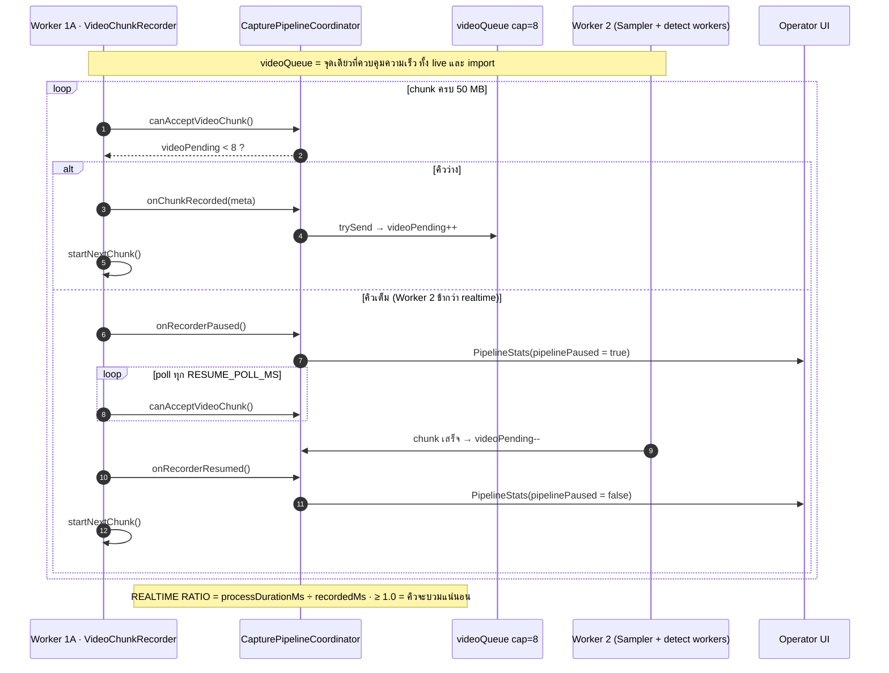

# AutoBots Sequence Flow — Mermaid

> Sequence diagram ของ **AutoBots Sports Camera** ตั้งแต่ Operator กด Start/Import จนภาพ JPEG ขึ้น Gallery และเขียน `session_log.txt` + `perf_report.json`
> อ้างอิงโค้ดจริง **v0.1.4**: `OperatorViewModel` · `CapturePipelineCoordinator` · `VideoChunkRecorder` · `ImportedVideoSplitter` · `VideoFrameSampler` · `VideoFrameProcessor` · `WriteQueue` · `LocalDeliveryWriter`
>
> ภาพรวมแบบ text/ตาราง อยู่ที่ [PIPELINE_FLOW.md](./PIPELINE_FLOW.md)

---

## 1. Full Pipeline — Live Capture + Import Video

> **Worker 2 เป็นสองเธรดตั้งแต่ v0.1.4** — Sampler (producer) กับ Detect worker (consumer) คั่นด้วย `Channel` ขนาด 2
> ก่อนหน้านั้นทุกอย่างรันอยู่ในลูป decode และบล็อก decoder ไว้ ดู [RELEASE_0_1_4.md](./RELEASE_0_1_4.md)

```mermaid
sequenceDiagram
    autonumber

    actor Operator
    participant UI as OperatorShellScreen / ViewModel
    participant Coord as CapturePipelineCoordinator
    participant Recorder as Worker 1A · VideoChunkRecorder
    participant Splitter as Worker 1B · ImportedVideoSplitter
    participant VQ as videoQueue Channel cap=8
    participant Sampler as Worker 2P · VideoFrameSampler + MediaCodec
    participant FQ as frameQueue Channel cap=2
    participant Detect as Worker 2C · detect worker ×2
    participant MLKit as ML Kit Face / Pose (หนึ่งตัวต่อ worker)
    participant Sharp as FaceSharpnessScorer CPU
    participant Sel as selectKeepers — ท้าย chunk
    participant WQ as WriteQueue cap=48
    participant Writer as LocalDeliveryWriter
    participant Store as MediaStore / Gallery

    alt Live Capture
        Operator->>UI: กด Start
        UI->>UI: ตรวจ camera permission + storage
        UI->>Coord: CapturePipelineCoordinator.create()
        Coord->>Coord: sessionDir = cache/autobots/{sessionId}, facesDir
        Coord->>VQ: เปิด videoQueue + start Worker 2 loop
        UI->>Coord: setResolution(FHD/UHD), setExtractionTarget(Face/Pose)
        UI->>Recorder: start() ผูก CameraX VideoCapture
        Coord->>Coord: onRecordingStarted() → beginSession(LiveCapture)
    else Import Video
        Operator->>UI: กด Import แล้วเลือกไฟล์ (OpenDocument)
        UI->>Coord: importVideo(uri, displayName)
        Coord->>Coord: beginSession(VideoImport) · albumFolder = ext_DDMMYYYY_HHMM
        Coord->>Splitter: probe(uri)
        Splitter-->>Coord: width × height × rotation × duration
        Coord->>Coord: StreamResolution.fromVideoDimensions() → FHD หรือ UHD
        Coord->>Splitter: split(targetSegmentBytes = 50 MB)
    end

    loop Worker 1 ผลิต chunk (Live = record · Import = remux)
        alt Live Capture
            Recorder->>Recorder: บันทึก MP4 จนถึง 50 MB
            Recorder->>Coord: canAcceptVideoChunk()?
            alt videoQueue เต็ม (pending = 8)
                Coord-->>Recorder: false
                Recorder->>Coord: onRecorderPaused() — หยุดหมุน chunk
                Recorder->>Recorder: poll จนคิวว่างแล้ว resumeIfPaused()
            else คิวว่าง
                Coord-->>Recorder: true
                Recorder->>Coord: onChunkRecorded(ChunkCaptureMeta)
            end
        else Import Video
            Splitter->>Splitter: MediaExtractor อ่าน sample → MediaMuxer เขียน segment
            Note over Splitter: ตัด chunk ที่ Keyframe เท่านั้น + rebase PTS (remux ไม่ re-encode)
            Splitter->>Splitter: awaitQueueSpace() — สะสมเวลาเป็น splitBlockedMs
            Splitter->>Coord: onChunkReady(ChunkCaptureMeta)
            Splitter->>UI: onProgress(importPercent 0–99)
        end

        Coord->>Coord: chunksRecorded++ · ChunkRecord(status = Pending)
        Coord->>VQ: trySend(ChunkWorkItem(index, file))
        alt trySend ไม่สำเร็จ
            Coord->>Coord: videoPending-- และ log "Video queue full, dropped"
        end
        Coord->>UI: publishStats(PipelineStats)
    end

    loop Worker 2 — แต่ละ chunk ใน videoQueue (chunk ประมวลผลทีละก้อน)
        VQ-->>Sampler: ChunkWorkItem
        Coord->>Coord: ChunkRecord.status = Processing
        Coord->>Detect: launch detect worker ×2 (Dispatchers.Default)
        Coord->>Sampler: sampleFrames(file, 120 ms) [Dispatchers.IO]

        par Producer — เธรด decoder
            loop ทุก sample frame (~8.3 fps)
                Sampler->>Sampler: hardware MediaCodec decode
                Sampler->>Sampler: YUV420 → NV21 → JPEG 92% → Bitmap (ยังไม่หมุน)
                Note over Sampler: yuv_jpeg_argb — 49.5% ของ wall · คอขวดที่เหลืออยู่
                Sampler->>FQ: send(ptsUs, bitmap, rotation)
                Note over FQ: เต็ม → decoder รอ · วัดเป็น queue_wait
            end
            Sampler->>FQ: close()
        and Consumer — detect worker แต่ละตัว
            loop จนกว่า frameQueue จะปิด
                FQ-->>Detect: receive() — เวลารอวัดเป็น worker_idle
                Detect->>Detect: downscale แบบ halving → rotate ที่ 640px → detect bitmap

                alt ExtractionTarget = Face
                    Detect->>MLKit: FaceDetector FAST + enableTracking
                    MLKit-->>Detect: face bounds
                    Detect->>Detect: เลือก face ใหญ่สุด · subjectRatio ≥ 3.5%
                else ExtractionTarget = Pose
                    Detect->>MLKit: PoseDetector SINGLE_IMAGE
                    MLKit-->>Detect: torso bounds (ไหล่ + สะโพก)
                    Detect->>Detect: torsoRatio ≥ 25%
                end

                alt ไม่พบ subject หรือ subject เล็กเกินไป
                    Detect->>Detect: rejects.noSubject / tooSmall · skipped++ · recycle
                    Note over Detect: เฟรมที่ถูกตัดที่นี่ ไม่ต้องจ่ายค่า rotate 4K เลย
                else ผ่านด่านขนาด
                    Detect->>Detect: rotate ภาพเต็ม 4K (~52 ms)
                    Detect->>Detect: mapRect() clamp เข้าขอบภาพ
                    alt ROI < 8 px — วัดไม่ได้
                        Detect->>Detect: rejects.roiInvalid · skipped++
                    else ROI ใช้ได้
                        Detect->>Sharp: scoreNormalized(bitmap, roi) — Laplacian variance
                        Sharp-->>Detect: sharpness score
                        alt score < minSharpness (FHD 80 · UHD 65)
                            Detect->>Detect: rejects.tooSoft · skipped++
                        else score ผ่าน
                            Detect->>Detect: saveFrame ทันที → {face|pose}_c###_{ptsUs}.jpg (JPEG 95%)
                            Detect->>Detect: candidates += SavedCandidate(file, sharpness, ptsUs)
                        end
                    end
                end
                Detect->>UI: onProgress(currentChunkPercent)
            end
        end

        Note over Sel: worker เสร็จไม่เรียงลำดับ — dedup จึงทำครั้งเดียวหลังทุกตัว join
        Sel->>Sel: sort candidates ตาม ptsUs
        loop ทุกหน้าต่าง DEDUP_WINDOW_US (1 s)
            Sel->>Sel: จัดอันดับตาม sharpness → เก็บ top 3 · ที่เหลือ file.delete() + skipped++
        end
        Sel-->>Coord: VideoProcessResult(kept, skipped, framesSampled, durationMs, savedFiles เรียงตาม PTS)
        Coord->>Coord: ChunkRecord.status = Done + metrics
        Coord->>Coord: recordChunkEndToEnd — queue wait · REALTIME RATIO

        loop ทุกไฟล์ใน savedFiles
            Coord->>WQ: enqueue(jpegFile)
            alt WriteQueue เต็ม
                WQ->>WQ: drop + log "Queue full"
            else
                WQ->>Writer: publish(file) [Dispatchers.IO]
                Writer->>Store: MediaStore.Images insert → DCIM/AutoBots/{subfolder}/
                Store-->>Writer: content Uri (IS_PENDING 0)
                Writer-->>WQ: Uri
                WQ->>WQ: ลบ temp file ใน cache · pending.decrementAndGet()
                WQ->>Coord: onDelivered(uri) + onDeliveredFile(file)
                Note over WQ: callback ต้องมา *หลัง* ลด pending — ไม่งั้น drain ไม่เกิด (บั๊ก v0.1.3 ข้อ 8)
                Coord->>Coord: recordMomentToGallery — MOMENT→GALLERY latency
                Coord->>UI: publishStats + onPhotoDelivered(uri)
            end
        end

        Coord->>Coord: videoPending-- · maybeNotifyDrainComplete()
    end

    Note over Coord,Store: Drain — ไม่ recording / ไม่ importing / worker ว่าง / videoQueue = 0 / WriteQueue = 0

    Operator->>UI: กด Stop (เฉพาะ Live)
    UI->>Recorder: stop()
    Recorder->>Coord: onChunkRecorded(chunk สุดท้าย) แล้ว onRecorderStopSettled()

    Coord->>Coord: finalizeCurrentSession() → status Done หรือ Failed
    Coord->>Coord: buildSessionRecord(chunkHistory) → PipelineSessionRecord
    Coord->>Coord: toLogText() → session_log.txt · buildPerfReport() → perf_report.json
    Coord->>Coord: mirror cache/autobots/{sessionId}/ และ cache/autobots/logs/{subfolder}/
    Coord->>Writer: publishText("session_log.txt") · publishText("perf_report.json")
    Writer->>Store: legacy File → DCIM/AutoBots/{subfolder}/
    alt legacy ไม่สำเร็จ (API 29+)
        Writer->>Store: fallback MediaStore.Downloads → Download/AutoBots/{subfolder}/
    end
    Store-->>Writer: log Uri
    Coord->>UI: onDrainComplete()
    UI-->>Operator: Session card ใน ChunkHistoryPage — N chunks · X faces · total time
```



---

## 2. Backpressure — ทำไม Live ถึงหยุดหมุน chunk



> Import ใช้ backpressure ตัวเดียวกัน — `ImportedVideoSplitter.split(canAcceptChunk = ::canAcceptVideoChunk)` ทำให้ไฟล์ยาวแค่ไหนก็ไม่ระเบิด memory
> เวลาที่ splitter จอดรอตรงนี้ถูกแยกออกมาเป็น `splitBlockedMs` ตั้งแต่ v0.1.4 ไม่ปนกับความเร็ว remux (`splitActiveMs`) อีก

---

## 3. คิวสองชั้นใน Worker 2 และการอ่านว่าฝั่งไหนคือคอขวด

```
videoQueue(8) ──▶ Sampler ──▶ frameQueue(2) ──▶ detect worker ×2 ──▶ selectKeepers ──▶ WriteQueue(48)
   ระดับ chunk        producer      ระดับ frame        consumer          ท้าย chunk
```

| stage ใน `perf_report.json` | อยู่ฝั่ง | อ่านว่า |
|--|--|--|
| `queue_wait` | producer | decoder รอ worker ว่าง → **consumer คือคอขวด** เพิ่ม `DETECT_WORKERS` |
| `worker_idle` | consumer | worker ไม่มีเฟรมทำ → **decoder คือคอขวด** มีแต่งาน `yuv_jpeg_argb` ที่ช่วยได้ |

`sharePercent` หารด้วย wall clock จริง จึง **รวมกันได้เกิน 100%** โดยตั้งใจ — ส่วนที่เกินคือมูลค่าของการทำงานทับซ้อน

---

## 4. หมายเหตุตัวเลข (source of truth ในโค้ด)

| ค่า | ที่มา | ค่าปัจจุบัน |
|-----|-------|-------------|
| Sample interval | `StreamResolution.FRAME_SAMPLE_INTERVAL_MS` | 120 ms (ทั้ง FHD/UHD) |
| Chunk target | `StreamResolution.chunkTargetBytes` | 50 MB |
| Video queue | `CapturePipelineCoordinator.VIDEO_QUEUE_CAPACITY` | 8 |
| Image queue | `CapturePipelineCoordinator.IMAGE_QUEUE_CAPACITY` | 48 |
| **Frame queue** | `VideoFrameProcessor.FRAME_QUEUE_CAPACITY` | **2** — เพดาน memory (~33 MB/ใบ ที่ UHD) |
| **Detect workers** | `VideoFrameProcessor.DETECT_WORKERS` | **2** |
| Dedup window | `VideoFrameProcessor.DEDUP_WINDOW_US` | 1,000,000 µs |
| **Keep ต่อ window** | `VideoFrameProcessor.MAX_KEEP_PER_WINDOW` | **3** |
| Min sharpness | `MIN_SHARPNESS` / `MIN_SHARPNESS_UHD` | 80.0 / 65.0 |
| Min subject ratio | `MIN_FACE_HEIGHT_RATIO` / `MIN_TORSO_HEIGHT_RATIO` | **3.5%** / 25% |
| ML Kit min face | `OfflineFaceDetector.setMinFaceSize` | 0.025 (เทียบกับ**ความกว้าง**) |
| Detect width | `ProcessProfile.detectBitmapWidth` | 640 px |
| **Downscale mode** | `VideoFrameProcessor.MULTISTEP_DOWNSCALE` | **halving** (สวิตช์สำหรับ A/B) |
| JPEG quality | sampler 92% (decode) · `saveFrame` 95% (deliverable) | — |
| perf schema | `PerfReport.SCHEMA_VERSION` | **2** — `sharePercent` เทียบกับ schema 1 ไม่ได้ |

---

## Related

- เหตุผลของโครงสร้างสองเธรด: [RELEASE_0_1_4.md](./RELEASE_0_1_4.md)
- Pipeline รายละเอียด: [PIPELINE_FLOW.md](./PIPELINE_FLOW.md)
- Operator guide: [OPERATOR_FLOW.md](./OPERATOR_FLOW.md)
- Architecture: [ARCHITECTURE.md](./ARCHITECTURE.md)
- Code layout: [STRUCTURE.md](./STRUCTURE.md)
- Doc index: [DOCS.md](./DOCS.md)
