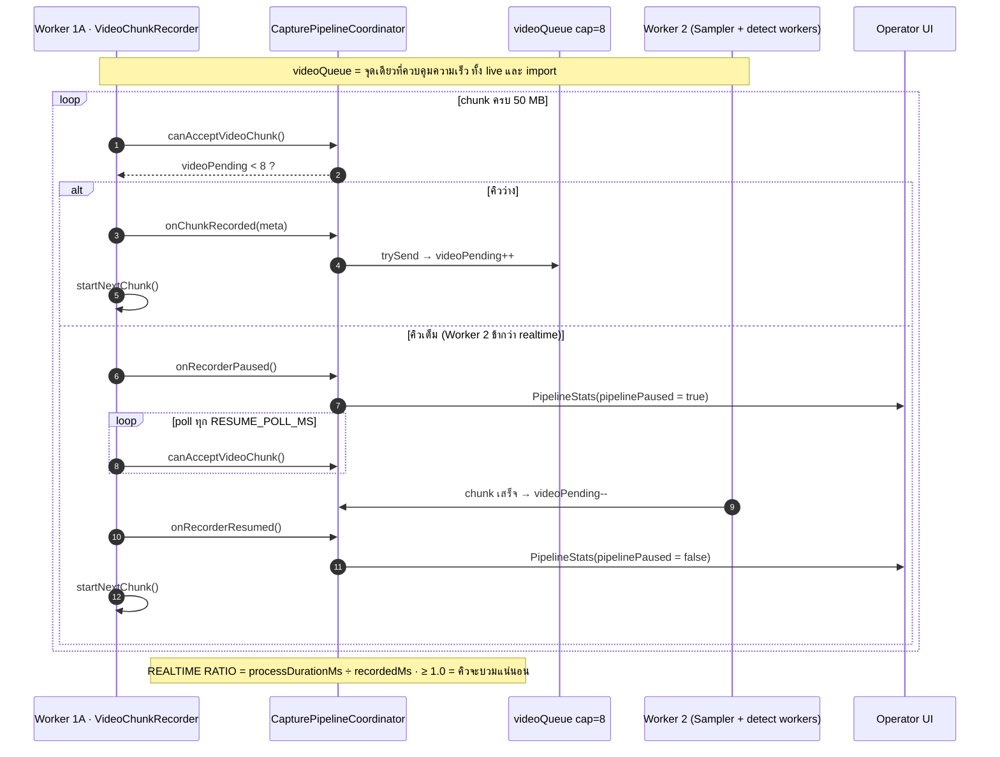

# AutoBots Sequence Flow — Mermaid

> Sequence diagram ของ **AutoBots Sports Camera** ตั้งแต่ Operator กด Start/Import จนภาพ JPEG ขึ้น Gallery และเขียน `session_log.txt` + `perf_report.json`
> อ้างอิงโค้ดจริง **v0.1.4**: `OperatorViewModel` · `CapturePipelineCoordinator` · `VideoChunkRecorder` · `ImportedVideoSplitter` · `VideoFrameSampler` · `SampledFrame` · `VideoFrameProcessor` · `DetectorSet` · `WriteQueue` · `LocalDeliveryWriter` · `DvfsProbe`
>
> ตัวเลข ms/% ทั้งหมดในเอกสารนี้มาจาก **TC-12** (`run4mins.mp4` · UHD · NPU · schema 4) ไม่ใช่ค่าประมาณ — ที่มาอยู่ใน [RELEASE_0_1_4.md](./RELEASE_0_1_4.md)
>
> ภาพรวมแบบ text/ตาราง อยู่ที่ [PIPELINE_FLOW.md](./PIPELINE_FLOW.md)

---

## 1. Full Pipeline — Live Capture + Import Video

> **Worker 2 เป็นสองเธรดตั้งแต่ v0.1.4** — Sampler (producer) กับ detect worker (consumer) คั่นด้วย `Channel`
> ก่อนหน้านั้นทุกอย่างรันอยู่ในลูป decode และบล็อก decoder ไว้
>
> **เฟรมข้ามคิวมาเป็น JPEG ไม่ใช่ bitmap** — producer หยุดที่ `nv21_jpeg` แล้ว worker เป็นคน decode: `inSampleSize` สำหรับ detect และ decode เต็มขนาดเฉพาะเฟรมที่ผ่านด่านขนาด (~24%) · นี่คือสิ่งที่พา `realtimeRatio` จาก 1.430 → **1.010** ดู [RELEASE_0_1_4.md](./RELEASE_0_1_4.md) ข้อ 7

```mermaid
sequenceDiagram
    autonumber

    actor Operator
    participant UI as OperatorShellScreen / ViewModel
    participant Coord as CapturePipelineCoordinator
    participant Recorder as Worker 1A · VideoChunkRecorder
    participant Splitter as Worker 1B · ImportedVideoSplitter
    participant VQ as videoQueue Channel cap=8
    participant Sampler as Worker 2P · VideoFrameSampler + MediaCodec
    participant FQ as frameQueue Channel cap=6 — ถือ JPEG
    participant Detect as Worker 2C · detect worker ×2
    participant Det as DetectorSet — ML Kit หรือ LiteRT GPU/NPU (หนึ่งชุดต่อ worker)
    participant Sharp as FaceSharpnessScorer CPU
    participant Sel as selectKeepers — ท้าย chunk
    participant WQ as WriteQueue cap=48
    participant Writer as LocalDeliveryWriter
    participant Store as MediaStore / Gallery

    alt Live Capture
        Operator->>UI: กด Start
        UI->>UI: ตรวจ camera permission + storage
        UI->>Coord: CapturePipelineCoordinator.create()
        Coord->>Coord: sessionDir = cache/autobots/{sessionId}, facesDir
        Coord->>VQ: เปิด videoQueue + start Worker 2 loop
        UI->>Coord: setResolution(FHD/UHD), setExtractionTarget(Face/Pose)
        UI->>Recorder: start() ผูก CameraX VideoCapture
        Coord->>Coord: onRecordingStarted() → beginSession(LiveCapture)
    else Import Video
        Operator->>UI: กด Import แล้วเลือกไฟล์ (OpenDocument)
        UI->>Coord: importVideo(uri, displayName)
        Coord->>Coord: beginSession(VideoImport) · albumFolder = ext_DDMMYYYY_HHMM
        Coord->>Splitter: probe(uri)
        Splitter-->>Coord: width × height × rotation × duration
        Coord->>Coord: StreamResolution.fromVideoDimensions() → FHD หรือ UHD
        Coord->>Splitter: split(targetSegmentBytes = 50 MB)
    end

    loop Worker 1 ผลิต chunk (Live = record · Import = remux)
        alt Live Capture
            Recorder->>Recorder: บันทึก MP4 จนถึง 50 MB
            Recorder->>Coord: canAcceptVideoChunk()?
            alt videoQueue เต็ม (pending = 8)
                Coord-->>Recorder: false
                Recorder->>Coord: onRecorderPaused() — หยุดหมุน chunk
                Recorder->>Recorder: poll จนคิวว่างแล้ว resumeIfPaused()
            else คิวว่าง
                Coord-->>Recorder: true
                Recorder->>Coord: onChunkRecorded(ChunkCaptureMeta)
            end
        else Import Video
            Splitter->>Splitter: MediaExtractor อ่าน sample → MediaMuxer เขียน segment
            Note over Splitter: ตัด chunk ที่ Keyframe เท่านั้น + rebase PTS (remux ไม่ re-encode)
            Splitter->>Splitter: awaitQueueSpace() — สะสมเวลาเป็น splitBlockedMs
            Splitter->>Coord: onChunkReady(ChunkCaptureMeta) → ประมาณ expectedChunks
            Splitter->>UI: onProgress(importPercent 0–99)
            Note over Splitter,UI: importPercent ไม่ได้ขับ progress bar อีกแล้วตั้งแต่ v0.1.4<br/>มันคำนวณจาก PTS ที่เพิ่ง mux จึงนิ่งตลอดที่ awaitQueueSpace จอดรอ (95% ของเวลา)<br/>บาร์ใช้ overallProcessingPercent จากฝั่ง extractor แทน · ที่นี่เหลือแค่ "split N/~M chunks"
        end

        Coord->>Coord: chunksRecorded++ · ChunkRecord(status = Pending)
        Coord->>VQ: trySend(ChunkWorkItem(index, file))
        alt trySend ไม่สำเร็จ
            Coord->>Coord: videoPending-- และ log "Video queue full, dropped"
        end
        Coord->>UI: publishStats(PipelineStats)
    end

    loop Worker 2 — แต่ละ chunk ใน videoQueue (chunk ประมวลผลทีละก้อน)
        VQ-->>Sampler: ChunkWorkItem
        Coord->>Coord: ChunkRecord.status = Processing
        Coord->>Detect: launch detect worker ×2 (Dispatchers.Default)
        Coord->>Coord: DvfsProbe.measureNs() ก่อนเริ่ม → chunks[].cpuProbeMs
        Note over Coord: งาน integer ขนาดคงที่ · เทียบข้าม chunk เพื่อดู DVFS drift<br/>🐛 probe ของ chunk 1 โดน JIT ปน ให้ข้ามไปตอนอ่าน
        Coord->>Sampler: sampleFrames(file, 120 ms) [Dispatchers.IO]

        par Producer — เธรด decoder · 105.6 ms/เฟรม รวม 89.7% ของ wall
            loop ทุก sample frame (~8.3 fps ที่ 120 ms)
                Sampler->>Sampler: hardware MediaCodec decode — decode 0.2 ms
                Sampler->>Sampler: YUV420 → NV21 — yuv_nv21 73.2 ms
                Note over Sampler: 61.6% ของ wall เดี่ยวๆ · loop อ่าน ByteBuffer.get() ทีละ byte<br/>คอขวดตัวใหญ่ที่สุดที่เหลือ
                Sampler->>Sampler: NV21 → JPEG 92% — nv21_jpeg 32.5 ms
                Note over Sampler: จบตรงนี้ ไม่ decode เป็น ARGB อีกแล้ว
                Sampler->>FQ: send(SampledFrame — JPEG ~2 MB + rotation)
                Note over FQ: เต็ม → decoder รอ · วัดเป็น queue_wait (TC-12: 0.27 ms — คิวว่างเกือบตลอด)
            end
            Sampler->>FQ: close()
        and Consumer — detect worker แต่ละตัว · worker_idle 107.7 ms/เฟรม
            loop จนกว่า frameQueue จะปิด
                FQ-->>Detect: receive() — เวลารอวัดเป็น worker_idle
                Detect->>Detect: decode(inSampleSize=2) → jpeg_argb_detect 34.2 ms
                Note over Detect: inSampleSize ให้กำลังของ 2 ตัวเดียวกับที่ halving loop เคยใช้<br/>ประหยัดแค่ 36% ไม่ใช่ 4 เท่า — entropy decode ไม่ย่อตาม
                Detect->>Detect: downscale → rotate ที่ 640px — scale_for_detect 5.6 ms

                alt ExtractionTarget = Face
                    Detect->>Det: face.detect(detectBmp) — ML Kit FAST หรือ face_det_lite
                    Det-->>Detect: face bounds
                    Note over Det: enableTracking ถูกถอดออกใน v0.1.4 — เป็นต้นเหตุของ roiInvalid ทั้งหมด<br/>และทำให้ผลไม่ deterministic
                    Detect->>Detect: เลือก face ใหญ่สุด · subjectRatio ≥ 3.0% (UHD) / 3.5% (FHD)
                else ExtractionTarget = Pose
                    Detect->>Det: pose.detect(detectBmp) — PoseDetector SINGLE_IMAGE
                    Det-->>Detect: torso bounds (ไหล่ + สะโพก)
                    Detect->>Detect: torsoRatio ≥ 25%
                end
                Note over Detect: detect 36.6 ms (NPU) · recycle detect bitmap ทิ้งทันที

                alt ไม่พบ subject หรือ subject เล็กเกินไป — 76% ของเฟรม
                    Detect->>Detect: rejects.noSubject / tooSmall · skipped++
                    Note over Detect: ไม่เคยแตะ pixel เต็มขนาดเลย — JPEG ถูกทิ้งไปทั้งก้อน
                else ผ่านด่านขนาด — 541/2281 = 23.7%
                    Detect->>Detect: decode(1) ภาพเต็ม 4K — jpeg_argb_full 53.6 ms
                    Detect->>Detect: rotate ภาพเต็ม — rotate 72.2 ms
                    Note over Detect: rotate ตอนนี้ใหญ่กว่า jpeg_argb_full เอง (14.4% ของ wall)
                    Detect->>Detect: mapRect() clamp เข้าขอบภาพ
                    alt ROI < 8 px — วัดไม่ได้
                        Detect->>Detect: rejects.roiInvalid · skipped++
                        Note over Detect: TC-12 ได้ 0 — ถอด tracking แล้วมันหายไปจริงตามที่คาด
                    else ROI ใช้ได้
                        Detect->>Sharp: scoreNormalized(bitmap, roi) — Laplacian variance 0.7 ms
                        Sharp-->>Detect: sharpness score
                        alt score < minSharpness (FHD 80 · UHD 65)
                            Detect->>Detect: rejects.tooSoft · skipped++
                            Note over Detect: 248 เฟรมจ่ายค่า decode เต็ม + rotate ไปแล้วก่อนถูกตัดที่นี่ — 31.2 s
                        else score ผ่าน
                            Detect->>Detect: saveFrame ทันที → {face|pose}_c###_{ptsUs}.jpg (JPEG 95%) — save_jpeg 93.2 ms
                            Detect->>Detect: candidates += SavedCandidate(file, sharpness, ptsUs)
                        end
                    end
                end
                Detect->>UI: onProgress(currentChunkPercent) — ทุกเฟรมที่ sample จึงขยับทุก ~105 ms
            end
        end

        Note over Sel: worker เสร็จไม่เรียงลำดับ — dedup จึงทำครั้งเดียวหลังทุกตัว join
        Sel->>Sel: sort candidates ตาม ptsUs
        loop ทุกหน้าต่าง DEDUP_WINDOW_US (1 s)
            Sel->>Sel: จัดอันดับตาม sharpness → เก็บ top 3 · ที่เหลือ file.delete() + skipped++
        end
        Note over Sel: TC-12: เข้ารหัสไป 293 ไฟล์ เก็บจริง 134 — ลบทิ้ง 159 ไฟล์ที่เขียนลงดิสก์แล้ว<br/>จำนวนรูปถูกจำกัดด้วยจำนวนหน้าต่าง ไม่ใช่จำนวน sample<br/>ลด sample interval จึงไม่ทำให้ได้รูปเพิ่ม — ต้องขยับ MAX_KEEP_PER_WINDOW (OQ-04)
        Sel-->>Coord: VideoProcessResult(kept, skipped, framesSampled, durationMs, savedFiles เรียงตาม PTS)
        Coord->>Coord: ChunkRecord.status = Done + metrics
        Coord->>Coord: recordChunkEndToEnd — queue wait · REALTIME RATIO

        loop ทุกไฟล์ใน savedFiles
            Coord->>WQ: enqueue(jpegFile)
            alt WriteQueue เต็ม
                WQ->>WQ: drop + log "Queue full"
            else
                WQ->>Writer: publish(file) [Dispatchers.IO]
                Writer->>Store: MediaStore.Images insert → DCIM/AutoBots/{subfolder}/
                Store-->>Writer: content Uri (IS_PENDING 0)
                Writer-->>WQ: Uri
                WQ->>WQ: ลบ temp file ใน cache · pending.decrementAndGet()
                WQ->>Coord: onDelivered(uri) + onDeliveredFile(file)
                Note over WQ: callback ต้องมา *หลัง* ลด pending — ไม่งั้น drain ไม่เกิด (บั๊ก v0.1.3 ข้อ 8)<br/>enqueue นับ pending ก่อน trySend แล้ว rollback เมื่อคิวเต็ม<br/>เพื่อไม่ให้ pendingCount อ่านเป็น 0 ระหว่างที่ยังมีงานค้าง
                Coord->>Coord: recordMomentToGallery — MOMENT→GALLERY latency
                Coord->>UI: publishStats + onPhotoDelivered(uri)
            end
        end

        Coord->>Coord: releaseChunkFile() — ลบ import_###.mp4 / chunk_###.mp4 ทิ้ง
        Note over Coord: ก่อน v0.1.4 ไม่มีใครลบเลย · videoQueue cap 8 คุมแค่จำนวนที่*รอคิว*<br/>cache จึงโตเท่าไฟล์ต้นฉบับ — 1.93 GB ที่ 4.5 นาที · ~51 GB ที่ 2 ชั่วโมง
        Coord->>Coord: videoPending-- · maybeNotifyDrainComplete()
    end

    Note over Coord,Store: Drain — ไม่ recording / ไม่ importing / worker ว่าง / videoQueue = 0 / WriteQueue = 0

    Operator->>UI: กด Stop (เฉพาะ Live)
    UI->>Recorder: stop()
    Recorder->>Coord: onChunkRecorded(chunk สุดท้าย) แล้ว onRecorderStopSettled()

    Coord->>Coord: finalizeCurrentSession() → status Done หรือ Failed
    Coord->>Coord: buildSessionRecord(chunkHistory) → PipelineSessionRecord
    Coord->>Coord: toLogText() → session_log.txt · buildPerfReport() → perf_report.json
    Coord->>Coord: mirror cache/autobots/{sessionId}/ และ cache/autobots/logs/{subfolder}/
    Coord->>Writer: publishText("session_log.txt") · publishText("perf_report.json")
    Writer->>Store: legacy File → DCIM/AutoBots/{subfolder}/
    alt legacy ไม่สำเร็จ (API 29+)
        Writer->>Store: fallback MediaStore.Downloads → Download/AutoBots/{subfolder}/
    end
    Store-->>Writer: log Uri
    Coord->>UI: onDrainComplete()
    UI-->>Operator: Session card ใน ChunkHistoryPage — N chunks · X faces · total time
```



---

## 2. Backpressure — ทำไม Live ถึงหยุดหมุน chunk



> Import ใช้ backpressure ตัวเดียวกัน — `ImportedVideoSplitter.split(canAcceptChunk = ::canAcceptVideoChunk)` ทำให้ไฟล์ยาวแค่ไหนก็ไม่ระเบิด memory
> เวลาที่ splitter จอดรอตรงนี้ถูกแยกออกมาเป็น `splitBlockedMs` ตั้งแต่ v0.1.4 ไม่ปนกับความเร็ว remux (`splitActiveMs`) อีก

---

## 3. คิวสองชั้นใน Worker 2 และการอ่านว่าฝั่งไหนคือคอขวด

```
videoQueue(8) ──▶ Sampler ──▶ frameQueue(6) ──▶ detect worker ×2 ──▶ selectKeepers ──▶ WriteQueue(48)
   ระดับ chunk        producer       JPEG ~2 MB       consumer          ท้าย chunk
                    หยุดที่ JPEG     (เคยเป็น ARGB 33 MB)
```

### stage ทั้งหมดใน schema 4 และตัวเลขจริงจาก TC-12

| stage | ฝั่ง | ms/เฟรม | % ของ wall | อ่านว่า |
|--|--|--|--|--|
| `decode` | producer | 0.20 | 0.5% | dequeue จาก MediaCodec — ไม่เคยเป็นปัญหา |
| **`yuv_nv21`** | producer | **73.2** | **61.6%** | **คอขวดตัวใหญ่ที่สุด** · loop Kotlin อ่าน `ByteBuffer.get()` ทีละ byte ~2M ครั้ง/เฟรม |
| `nv21_jpeg` | producer | 32.5 | 27.4% | platform code — ไปต่อยาก |
| `queue_wait` | producer | 0.27 | 0.2% | decoder รอ worker → **consumer คือคอขวด** · ต่ำมาก = คิวว่างเกือบตลอด |
| `worker_idle` | consumer | 107.7 | 90.7% | worker ไม่มีเฟรมทำ → **producer คือคอขวด** (ยังใช่อยู่ แต่ลดจาก 211–220 มาครึ่งหนึ่ง) |
| `jpeg_argb_detect` | consumer | 34.2 | 28.8% | ทุกเฟรม · `inSampleSize=2` |
| `scale_for_detect` | consumer | 5.6 | 4.7% | ย่อจาก 1920 → 1137 แล้ว rotate ที่ 640px |
| `detect` | consumer | 36.6 | 30.8% | NPU · ชื่อ stage เดียวกันทุก backend จึงเทียบข้าม run ได้ |
| `jpeg_argb_full` | consumer | 53.6 × **23.7%** | 10.7% | เฉพาะเฟรมที่ผ่านด่านขนาด |
| `rotate` | consumer | 72.2 × 23.7% | 14.4% | **ใหญ่กว่า `jpeg_argb_full` เอง** |
| `sharpness` | consumer | 0.75 | 0.1% | — |
| `save_jpeg` | consumer | 93.2 × **12.8%** | 10.1% | 293 ไฟล์ · dedup ลบทิ้งทีหลัง 159 |

**invariant ที่ต้องตรงทุก run:** `jpeg_argb_detect n` = `framesSampled` · `jpeg_argb_full n` = `rotate n` = candidates + `tooSoft` + `roiInvalid` · `sharpness n` = `rotate n` − `roiInvalid`

`sharePercent` หารด้วย wall clock จริง จึง **รวมกันได้เกิน 100%** โดยตั้งใจ — ส่วนที่เกินคือมูลค่าของการทำงานทับซ้อน

> **`yuv_jpeg_argb` ไม่มีแล้วใน schema 4** — มันเคยรวม NV21 + JPEG + ARGB decode ไว้ก้อนเดียวบน producer พอ ARGB ย้ายไปฝั่ง consumer ชื่อเดิมจึงไม่มีความหมายเดิมอีก · รายงาน schema 3 เทียบ share ต่อ stage กับ schema 4 ตรงๆ ไม่ได้ ตัวที่ใกล้ที่สุดคือผลรวมของ `yuv_nv21` + `nv21_jpeg` + `jpeg_argb_detect` + `jpeg_argb_full`

---

## 4. หมายเหตุตัวเลข (source of truth ในโค้ด)

| ค่า | ที่มา | ค่าปัจจุบัน |
|-----|-------|-------------|
| Sample interval | `StreamResolution.FRAME_SAMPLE_INTERVAL_MS` | 120 ms (ทั้ง FHD/UHD) — ดูหมายเหตุใต้ตาราง |
| Chunk target | `StreamResolution.chunkTargetBytes` | 50 MB |
| Video queue | `CapturePipelineCoordinator.VIDEO_QUEUE_CAPACITY` | 8 |
| **ลบ chunk หลังใช้** | `CapturePipelineCoordinator.KEEP_PROCESSED_CHUNKS` | **false** — ลบทิ้ง · `true` = สวิตช์ debug ที่กิน cache เท่าไฟล์ต้นฉบับ |
| Image queue | `CapturePipelineCoordinator.IMAGE_QUEUE_CAPACITY` | 48 |
| **Frame queue** | `VideoFrameProcessor.FRAME_QUEUE_CAPACITY` | **6** — ~2 MB/ช่อง (JPEG) · เคยเป็น 2 ตอนที่ถือ ARGB 33 MB · TC-12 บอกว่ายังไม่ได้ผลอะไร |
| **Detect workers** | `VideoFrameProcessor.DETECT_WORKERS` | **2** — Compare all บังคับเป็น 1 |
| **Detector backend** | `DetectorBackend` (เลือกจาก UI) | ML Kit FAST *(default)* · LiteRT GPU · LiteRT NPU · Compare all |
| Dedup window | `VideoFrameProcessor.DEDUP_WINDOW_US` | 1,000,000 µs |
| **Keep ต่อ window** | `VideoFrameProcessor.MAX_KEEP_PER_WINDOW` | **3** — เพดานของจำนวนรูป ไม่ใช่ sample interval (OQ-04) |
| Min sharpness | `MIN_SHARPNESS` / `MIN_SHARPNESS_UHD` | 80.0 / 65.0 |
| **Min subject ratio** | `MIN_FACE_HEIGHT_RATIO_FHD` / `_UHD` / `MIN_TORSO_HEIGHT_RATIO` | **FHD 3.5% · UHD 3.0%** / 25% — UHD ลดใน v0.1.4 เพราะ 0.035 อยู่บนจุดชันที่สุดของการกระจาย |
| ML Kit min face | `OfflineFaceDetector.setMinFaceSize` | 0.025 (เทียบกับ**ความกว้าง**) |
| **ML Kit tracking** | `OfflineFaceDetector` | **ถอดออกแล้ว** — ต้นเหตุของ `roiInvalid` ทั้งหมด และทำให้ผลไม่ deterministic |
| Detect width | `ProcessProfile.detectBitmapWidth` | 640 px (ทั้ง FHD/UHD) |
| **Downscale mode** | `VideoFrameProcessor.MULTISTEP_DOWNSCALE` | **halving** — ตอนนี้ทำผ่าน `sampleSizeFor()` + `inSampleSize` · `false` คืน sampleSize 1 ให้ TC-05 ยังวัดสิ่งเดิม |
| JPEG quality | `VideoFrameSampler.JPEG_QUALITY` 92 (กลางทาง) · `saveFrame` 95 (deliverable) | 92 คือตัวที่**บอกคุณภาพจริง** เพราะ 95 เข้ารหัสทับของที่ผ่าน 92 มาแล้ว |
| **CPU probe** | `DvfsProbe.ITERATIONS` / `ROUNDS` | 2,000,000 / 3 รอบเอาค่าต่ำสุด · ~5 ms ต่อ chunk |
| **frames[] budget** | `PerfReport.MAX_FRAME_DIAGS` | **30,000** — เกินแล้ว chunk หลังๆ เหลือแต่ค่ารวม + sharpness |
| **deviceLoad** | `PerfReport.MAX_LOAD_SAMPLES` | **600** — เต็มแล้ว**หารสอง**แล้วเพิ่ม stride อนุกรมจึงกินทั้ง session เสมอ |
| Event budget | `PerfReport.MAX_EVENTS` | 4,000 — เกินแล้วนับไว้ใน `truncation.eventsDropped` ไม่เงียบ |
| perf schema | `PerfReport.SCHEMA_VERSION` | **4** — `yuv_jpeg_argb` หายไป · เทียบ share ต่อ stage กับ schema 3 ไม่ได้ |

> **ทำไมไม่ลด sample interval ให้ต่ำกว่า 120 ms:** ต้นทางเป็น 25 fps (40 ms/เฟรม) เงื่อนไข emit จึง quantize ให้เหลือ 3 ทางเลือกจริงคือ **120 / 80 / 40 ms** (ตั้ง 60 จะได้ 80) · งานโตเป็นเส้นตรงตามจำนวน sample — 80 ms คือ 1.5× (ratio ~1.51) และ 40 ms คือ 3× (ratio ~3.03) · **แต่ไม่ได้รูปเพิ่ม** เพราะจำนวนรูปถูกจำกัดด้วย `MAX_KEEP_PER_WINDOW` × จำนวนหน้าต่าง ไม่ใช่จำนวน sample และคนเดินผ่านกล้องอยู่ในเฟรม 1–2 วินาที = 8–17 sample ที่ 120 ms อยู่แล้ว จึงไม่มีใครถูกมองข้าม

---

## 5. อะไรเกิดขึ้นเมื่อ session ยาวขึ้น

สเกลจาก `run4mins.mp4` (273.7 s · 1.93 GB · 36 chunk · 2,281 sample · 134 รูป) ตรงๆ:

| | 4.5 นาที | 1 ชั่วโมง | 2 ชั่วโมง |
|--|--|--|--|
| chunk | 36 | ~475 | ~950 |
| sample | 2,281 | ~30,000 | ~60,000 |
| รูปที่ส่งออก | 134 | ~1,800 | ~3,500 |
| `.mp4` ค้างใน cache *(ก่อน v0.1.4)* | 1.93 GB | ~25 GB | ~51 GB |
| `.mp4` ค้างใน cache *(ตอนนี้)* | ≤ 8 chunk ≈ 420 MB | เท่าเดิม | เท่าเดิม |

สามกลไกที่คุมไว้ — ทุกตัวรายงานตัวเองในบล็อก `truncation` ของ `perf_report.json`:

| กลไก | ทำอะไร | อ่านจาก |
|--|--|--|
| `releaseChunkFile()` | ลบ chunk ทันทีที่ Worker 2 อ่านเสร็จ · ดิสก์จึงผูกกับความลึกคิว ไม่ใช่ความยาวคลิป | log `Could not delete processed chunk` เมื่อลบไม่ผ่าน |
| `MAX_FRAME_DIAGS` | chunk แรกๆ เก็บ `frames[]` ครบ · เกินงบแล้วเหลือแต่ค่ารวม **แต่ sharpness percentile ยังอยู่** เพราะคำนวณตอน `addChunk()` ก่อนตัด | `truncation.frameDiagsDropped` · `chunks[].framesOmitted` |
| `deviceLoad` decimation | เต็ม 600 แล้วทิ้ง index คี่ + เพิ่ม stride เป็นสองเท่า · อนุกรมกินทั้ง session เสมอ (2 ชม. → 476 จุด ระยะห่าง 8 ครอบคลุมถึงจุดจบ) | `truncation.loadStride` |

**ยังไม่ได้แก้:** `publishStats()` ถูกเรียกทุก sample และ snapshot `chunkHistory` ทั้งก้อนทุกครั้ง — ที่ 950 chunk × 60,000 ครั้งคือ ~57 ล้าน element copy ที่ขโมย CPU จาก pipeline

> **ยังไม่เคยรันคลิปยาวจริงสักครั้ง** ทั้งตารางนี้คือการคูณจาก run4mins · **TC-14 (20–30 นาที) ต้องผ่านก่อน TC-15 (1 ชั่วโมง)** และสิ่งที่ต้องดูคือ cache **ระหว่าง**รัน ไม่ใช่หลังจบ — ถ้าการลบไม่ทำงาน หลังจบก็ยังดูปกติได้ถ้าเครื่องมีที่ว่างพอ

---

## Related

- **ศัพท์ในไดอะแกรมนี้ (ไทย)**: [GLOSSARY_TH.md](./GLOSSARY_TH.md) — producer/consumer · backpressure · YUV/NV21 · DVFS · PTS · keyframe
- เหตุผลของโครงสร้างสองเธรด: [RELEASE_0_1_4.md](./RELEASE_0_1_4.md)
- Pipeline รายละเอียด: [PIPELINE_FLOW.md](./PIPELINE_FLOW.md)
- Operator guide: [OPERATOR_FLOW.md](./OPERATOR_FLOW.md)
- Architecture: [ARCHITECTURE.md](./ARCHITECTURE.md)
- Code layout: [STRUCTURE.md](./STRUCTURE.md)
- Doc index: [DOCS.md](./DOCS.md)
