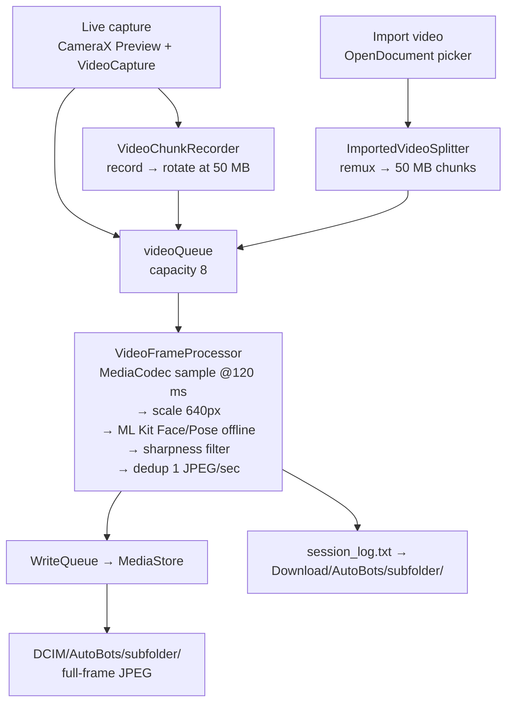

# v0.1.2 — Summary Report

> Written per [REPORT_GUIDELINE.md](../../docs/REPORT_GUIDELINE.md).
> Sections 9–12 are `TBD` until the field test is run.

---

## 1. Snapshot

| Field | Value |
|-------|-------|
| Version | **v0.1.2** — `appVersionName=0.1.2`, `appVersionCode=12` |
| Report date | TBD |
| Phase | **B1** — video chunk record + offline extract + gallery |
| Theme | Plan B: continuous video chunk recording (live + import) → offline Face/Pose extraction → local gallery + session log |
| Tester | TBD |
| Device | TBD |
| Build under test | TBD (APK path / commit sha) |
| Verdict | **TBD** |
| Score | **TBD / 100** |

Shipped feature list: [CHANGELOG.md § v0.1.2](../../docs/CHANGELOG.md)

---

## 2. What & why

**What this version does**

v0.1.2 replaces the v0.1 live-stills path with a video-first pipeline. The camera records
continuously into MP4 chunks and never runs face detection on the live preview. Detection happens
afterwards, offline, by decoding each finished chunk. The same pipeline also accepts an **imported**
video file from device storage, so testing no longer requires being on site with the tripod.

Output is a folder of full-frame JPEGs in `DCIM/AutoBots/` plus a `session_log.txt`.

**Why**

| Problem in v0.1 | How v0.1.2 addresses it |
|-----------------|-------------------------|
| Live `ImageAnalysis` + face overlay competed with capture for the camera pipeline, causing dropped frames and thermal load | Camera binds **Preview + VideoCapture only**; no live analysis while recording |
| A missed moment was gone forever — detection had to be right in real time | Video is recorded first; detection can be re-run and re-tuned against the same footage |
| Long sessions produced one huge unmanageable file and risked losing everything on crash | Chunks auto-finalize at **50 MB**, so a failure costs at most the current chunk |
| No way to test the CV path without a live shoot | **Import video** path feeds the identical queue as live capture |

Product scope: [PRD.md](../../docs/PRD.md) · Slice detail: [IMPLEMENTATION.md](../../docs/IMPLEMENTATION.md)

---

## 3. Scope

### In scope

- Live capture → chunked MP4 (50 MB rotate) → offline extract → gallery
- Import an existing video file → remux split → same extract path
- ML Kit **Face** (FAST) detection; **Pose** detection marked experimental
- 1080p and 4K stream resolution selection (locked while recording)
- Session history UI page, status chips, REC progress bar
- `session_log.txt` written to `Download/AutoBots/{subfolder}/` (API 29+)
- Remote Start/Stop + resolution over WebSocket

### Out of scope

| Item | Note |
|------|------|
| Live face overlay on preview | Preview only during record — by design this version |
| Burst stills / Passage Gate / Capture Zone Fire | v0.1 code remains in repo but is not wired |
| HTTP upload / cloud delivery | Local gallery only; planned B3 |
| Session JSON persistence | Text log only; UI history is in-memory per app run |
| Thumbnails in session history | Path list + metadata only |
| In-app preview streaming to Mac | Use scrcpy — [SCRCPY.md](../../docs/SCRCPY.md) |

---

## 4. Open questions

| ID | Question | Options | Impact | Owner | Status |
|----|----------|---------|--------|-------|--------|
| **OQ-01** | Why does 4K report *No face* on chunks that visibly contain faces? | (a) sharpness threshold too high at UHD, (b) decode/scale path loses detail, (c) ML Kit FAST model limit at this scale | Blocks 4K as a usable mode — the headline gap of this version | TBD | Open — tuning in **B2** |
| **OQ-02** | Should UHD sharpness stay at 65, or be normalized per-resolution instead of a fixed constant? | Keep 65 · lower it · compute relative to frame stats | Directly changes recall/precision trade-off; depends on OQ-01 | TBD | Open |
| **OQ-03** | Switch 4K to ML Kit **ACCURATE** model? | Keep FAST · ACCURATE for 4K only · ACCURATE always | Better recall vs. slower extract and more heat | TBD | Open |
| **OQ-04** | Is 120 ms sampling right for both 1080p and 4K? | Keep unified · per-resolution interval | Affects extract duration and CPU/thermal budget | TBD | Open |
| **OQ-05** | Is dedup at 1 JPEG/sec the right output density for coaches? | 1/s · 2/s · configurable | Changes output volume and review effort downstream | TBD | Open |
| **OQ-06** | Retire or re-wire the v0.1 stills path? | Re-wire in B4 · delete · keep frozen for reference | Repo carries dead code (`LeanBurstCapturer`, `FaceOverlay`, `MlKitFaceAnalyzer`) | TBD | Open — decision at **B4** |
| **OQ-07** | Is a 50 MB chunk the right rotate point for long sessions? | Keep 50 MB · size + max-duration cap | 4K fills 50 MB fast → many chunks; affects queue pressure (cap 8) | TBD | Open |

---

## 5. How it works



Both entry paths merge at `videoQueue`, so live and import share one extraction path.
When the queue is full the recorder pauses and resumes as the worker catches up.
Stop ends recording only — the partial chunk is finalized, queued, and the pipeline drains before IDLE.

Full detail: [PIPELINE_FLOW.md](../../docs/PIPELINE_FLOW.md) · Operator steps: [OPERATOR_FLOW.md](../../docs/OPERATOR_FLOW.md)

### Constants under test

| Constant | Value | Source of truth |
|----------|-------|-----------------|
| Chunk rotate size | 50 MB | `StreamResolution.CHUNK_TARGET_BYTES` |
| Frame sample interval | 120 ms (1080p and 4K) | `FRAME_SAMPLE_INTERVAL_MS` |
| Sharpness threshold | FHD ≥ 80 · UHD ≥ 65 | `FaceSharpnessScorer` |
| Detection scale | 640 px | `VideoFrameProcessor` |
| Output dedup | 1 JPEG / sec | `VideoFrameProcessor` |
| Video queue capacity | 8 chunks | `CapturePipelineCoordinator` |
| Live album folder | `yyyyMMdd_HHmmss` | `SessionAlbumNaming` |
| Import album folder | `ext_DDMMYYYY_HHMM` | `SessionAlbumNaming` |

---

## 6. Test setup

| Item | Value |
|------|-------|
| Device | TBD (model) |
| Android version | TBD |
| Free storage before run | TBD |
| Starting thermal state | TBD |
| App build | TBD (APK / commit) |
| Install method | `install_with_log.sh` — [BUILD.md](../../docs/BUILD.md) |
| Extraction target | Face (FAST) unless stated per test case |
| Log capture | `adb logcat` → `logs/` |
| Output pull | `sync_gallery.sh` → `output/` |

Input file manifest: [inputs.md](./inputs.md)

---

## 7. Test inputs

| ID | Input | Duration | Resolution | Conditions | Settings |
|----|-------|----------|------------|------------|----------|
| **TC-01** | Imported video file | 1 min | 1080p 30 fps | 1–3 runners, daylight, faces toward camera | Import · Face · 1080p |
| **TC-02** | Imported video file | 1 min | 4K 30 fps | Same scene as TC-01 | Import · Face · 4K |
| **TC-03** | Live capture | ~3 min | 1080p | Tripod, field setup per [FIELD_SETUP.md](../../docs/FIELD_SETUP.md) | Live · Face · 1080p |
| **TC-04** | Live capture, Stop before first rotate | ~20 s | 1080p | Stop while chunk is well under 50 MB | Live · Face · 1080p |
| **TC-05** | Live capture, long run | ~10 min | 1080p | Continuous; watch queue backpressure and thermal | Live · Face · 1080p |
| **TC-06** | Imported video file | 1 min | 1080p | Same as TC-01 | Import · **Pose** · 1080p |
| **TC-07** | Imported video file | 1 min | 1080p | **No people in frame** (negative control) | Import · Face · 1080p |

TC-01 and TC-02 should be the **same scene** shot at two resolutions — that is what makes OQ-01 diagnosable.

---

## 8. Expected results

Expectations are written **before** the run. Each references the constant it derives from (§5).

| ID | Expectation (measurable) | Derived from |
|----|--------------------------|--------------|
| **TC-01** | Session completes; ≥ 1 chunk produced; JPEG count > 0 and ≤ 60 (dedup 1/s over 60 s); folder `ext_DDMMYYYY_HHMM` created in `DCIM/AutoBots/`; `session_log.txt` written | dedup 1/s · `SessionAlbumNaming` |
| **TC-02** | **Same scene as TC-01** → JPEG count within a comparable range of TC-01 (target: ≥ 70% of TC-01 count). A result near 0 confirms the OQ-01 4K recall gap | 4K should not lose faces the 1080p run finds |
| **TC-03** | Chunks rotate at ~50 MB each; every chunk appears in Session history; JPEG count > 0; no crash; pipeline reaches IDLE only after the queue drains | `CHUNK_TARGET_BYTES` · drain-before-IDLE |
| **TC-04** | Chunk #1 is produced despite being far under 50 MB, is extracted, and its JPEGs appear — the partial-chunk-on-Stop fix | `awaitingRecorderFinalize` fix, v0.1.2 |
| **TC-05** | Recorder pauses when videoQueue hits 8 and resumes after; no dropped chunk; no crash; thermal chip stays out of a throttling state | queue capacity 8 |
| **TC-06** | Pose extraction runs end to end and produces JPEGs; experimental quality is acceptable to note, not to gate the release | Pose marked experimental |
| **TC-07** | 0 JPEG produced, no crash, session log still written — proving the pipeline rejects rather than emits noise | negative control |

Cross-cutting expectations for every TC: **no crash**, Stop always reaches IDLE, and the JPEG count in
`session_log.txt` matches the file count in the gallery folder.

---

## 9. Actual results

| ID | Expected (short) | Actual | Delta | Status |
|----|------------------|--------|-------|--------|
| TC-01 | 1080p import → JPEG > 0, ≤ 60 | TBD | TBD | **TBD** |
| TC-02 | 4K import → ≥ 70% of TC-01 count | TBD | TBD | **TBD** |
| TC-03 | Live 3 min → rotate at 50 MB, all chunks extracted | TBD | TBD | **TBD** |
| TC-04 | Stop before rotate → Chunk #1 extracted | TBD | TBD | **TBD** |
| TC-05 | 10 min → backpressure holds, no loss | TBD | TBD | **TBD** |
| TC-06 | Pose runs end to end | TBD | TBD | **TBD** |
| TC-07 | Empty scene → 0 JPEG, no crash | TBD | TBD | **TBD** |

### Measured numbers

| Metric | TC-01 (1080p) | TC-02 (4K) | Notes |
|--------|---------------|------------|-------|
| Chunks produced | TBD | TBD | |
| Frames sampled | TBD | TBD | at 120 ms |
| Faces detected | TBD | TBD | pre-sharpness |
| Rejected by sharpness | TBD | TBD | FHD 80 / UHD 65 |
| JPEG written | TBD | TBD | after dedup |
| Extract wall time | TBD | TBD | |
| Peak thermal state | TBD | TBD | |

### Observations

_TBD — fill after the run._

### Log excerpts

```
TBD — paste short excerpts only; full logs stay in logs/
```

---

## 10. Score

Rubric and bands: [REPORT_GUIDELINE.md §5](../../docs/REPORT_GUIDELINE.md)

| Dimension | Weight | Score /5 | Weighted | Evidence |
|-----------|--------|----------|----------|----------|
| Functional correctness | 30 | TBD | TBD | TC-01 … TC-07 |
| Output quality | 25 | TBD | TBD | TC-01 / TC-02 JPEG counts, OQ-01 |
| Stability | 20 | TBD | TBD | TC-03, TC-04, TC-05 |
| Performance | 15 | TBD | TBD | extract wall time, thermal, TC-05 |
| Operator UX | 10 | TBD | TBD | TC-03 field run |
| **Total** | **100** | | **TBD / 100** | |

**Verdict:** TBD

> Note for the scorer: if 4K recall (TC-02) is near zero, **Output quality** cannot score above 3,
> and the verdict should read *Ship with caveats — 1080p only* rather than a plain Ship.

---

## 11. Verdict & next actions

_Summary: TBD after §9 and §10 are filled._

| ID | Action | Why | Owner | Target |
|----|--------|-----|-------|--------|
| **NA-01** | Diagnose 4K *No face* — instrument reject reasons (sharpness vs. no-detection) per frame | Resolves OQ-01, the blocking gap for 4K | TBD | **B2** |
| **NA-02** | Trial normalized / per-resolution sharpness threshold | Resolves OQ-02 once NA-01 identifies the cause | TBD | **B2** |
| **NA-03** | Benchmark ML Kit ACCURATE vs FAST at 4K (recall vs. time vs. heat) | Resolves OQ-03 with data, not preference | TBD | **B2** |
| **NA-04** | HTTP upload / remote gallery delivery | Local-only delivery is the next functional gap | TBD | **B3** |
| **NA-05** | Decide re-wire vs. retire for the v0.1 stills path | Resolves OQ-06; removes dead code | TBD | **B4** |
| **NA-06** | Persist session history (JSON) so it survives app restart | Current history is in-memory only | TBD | TBD |

Phase definitions: [DOCS.md § Implementation phases](../../docs/DOCS.md)

---

## 12. Review comments

| ID | Reviewer | Date | Comment | Response | Status |
|----|----------|------|---------|----------|--------|
| — | — | — | _No comments yet._ | — | — |

Status vocabulary: `Open` · `Accepted` · `Rejected` · `Deferred`

---

## Related

- [CHANGELOG.md § v0.1.2](../../docs/CHANGELOG.md) — what shipped
- [PIPELINE_FLOW.md](../../docs/PIPELINE_FLOW.md) — pipeline internals
- [OPERATOR_FLOW.md](../../docs/OPERATOR_FLOW.md) — how to run a session
- [REPORT_GUIDELINE.md](../../docs/REPORT_GUIDELINE.md) — how this report is structured
